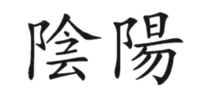
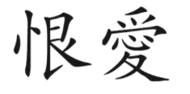
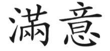
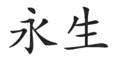
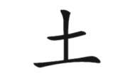

[Back](./)

[[1]](#book1) *Der wunde Punkt*  
[[2]](#book2) *Ändere deine Gedanken - Die lebendige Weisheit des TAO*  

&nbsp;

***

&nbsp;

 aus [1]:  

&nbsp;

> "Menschliche Größe besteht im wesentlichen aus der Fähigkeit, sich in den Umständen, in denen andere den Irrsinn wählen, für persönliche Erfüllung zu entscheiden."  

&nbsp;

[...] So halten wir jemanden für «intelligent», der über eine höhere schulische Ausbildung verfügt, der in einer der Wissensdisziplinen ein «As» ist – etwa in der Mathematik oder ganz allgemein den Naturwissenschaften, der über einen reichen Wortschatz verfügt, sich eigentlich überflüssige Fakten besonders gut merken kann oder vielleicht besonders schnell lesen kann. In den psychiatrischen Anstalten drängen sich jedoch neben den Kranken mit «normalem schulischem Werdegang» genauso viele Patienten, die über alle Zeugnisse der Gelehrsamkeit verfügen. Dagegen ist ein tatkräftiges, glückliches Leben, das jeden Tag und jeden einzelnen Augenblick eines jeden Tages auskostet, ein verläßlicherer Gradmesser für die Intelligenz des einzelnen.  

&nbsp;

> "Wenn Sie sich glücklich fühlen, wenn sie die Möglichkeiten des gegebenen Augenblicks voll ausschöpfen - dann sind Sie ein intelligenter Mensch."  

&nbsp;

[...] Das Lösen von Problemen kann außerdem zu Ihrem Wohlergehen beitragen; wenn Sie jedoch wissen, daß Sie, obwohl Sie eine bestimmte Schwierigkeit nicht zufriedenstellend lösen können, noch immer in der Lage sind, sich für ein glückliches Leben zu entscheiden oder sich zumindest nicht unglücklich fühlen müssen, dann sind Sie intelligent.  

[...] Wenn Sie Ihre Gedanken steuern und Ihre Gefühle wiederum aus Ihren Gedanken resultieren, dann können Sie auch Ihre Gefühle steuern, indem Sie nämlich die Gedanken beeinflussen, die ihnen vorausgehen. Einfach ausgedrückt: Sie meinen, manche Dinge oder manche Menschen würden Sie unglücklich machen; das stimmt aber nicht. Sie selbst machen sich unglücklich durch das, was Sie über die Menschen oder Dinge in Ihrem Leben denken! Ein freier, gesunder Mensch werden, das heißt lernen, anders zu denken. Wenn Sie erst Ihre Gedanken verändern können, werden bald Ihre neuen Gefühle zum Vorschein kommen.  

[...] Sie können sich also auf solche körperlichen Anforderungen wie das Erlernen der Koordination von Händen und Füßen beim Autofahren einstellen. Der gleiche Prozeß spielt sich im Bereich des Gefühlslebens ab, wenngleich er weniger bekannt ist. Ihre heutigen Gewohnheiten haben Sie erworben, indem Sie sie Ihr ganzes Leben hindurch eingeübt haben. Sie fühlen sich ganz automatisch unglücklich, ärgerlich, verletzt oder frustriert, weil Sie vor langer Zeit gelernt haben, in diesen Bahnen zu denken. Sie haben diese Verhaltensweisen akzeptiert und nie den Versuch gemacht, sie in Frage zu stellen. Genauso wie Sie diese selbstschädigenden Verhaltensweisen gelernt haben, können Sie auch lernen, sich nicht mehr unglücklich, ärgerlich, verletzt und frustriert zu fühlen.  

Solange Sie für sich selbst wertlos sind, solange Sie sich selbst nicht zu lieben vermögen, können Sie nicht wirklich geben. Wie sollte jemand, der wertlos ist, anderen Liebe schenken? Was wäre solche Liebe schon wert? Und wenn Sie schon keine Liebe geben können, können Sie erst recht keine empfangen. Was ist die Liebe wert, die von einem wertlosen Menschen kommt? Alles Geben und Nehmen, das ganze Drum und Dran der Liebe hat ein geliebtes eigenes Selbst ohne jede Abstriche zur Voraussetzung.  

Die gleiche Entscheidung können Sie für alle Ihre Selbstbilder treffen. So können Sie auch beschließen, sich für intelligent zu halten, indem Sie Ihren ganz persönlichen Maßstab an sich anlegen. Tatsächlich gilt:
>Je glücklicher Sie sich selbst machen können, desto intelligenter sind Sie.  

Schwächen, die Sie auf manchen Gebieten haben, zum Beispiel in Algebra, in der Rechtschreibung oder beim Formulieren, sind nichts anderes als die natürliche Folge von Entscheidungen, die Sie bisher getroffen haben. Sollten Sie sich jedoch entschließen, auf einem dieser Gebiete genügend lange zu üben, dann würden Sie zweifellos bessere Leistungen erzielen. Wenn Sie sich selbst nicht als sonderlich intelligenten Menschen ansehen, dann denken Sie daran zurück, was im ersten Kapitel gesagt worden ist. Der Grund, weshalb Sie sich selbst unterschätzen, liegt darin, daß Sie sich das haben einreden lassen und daß Sie sich im Hinblick auf bestimmte schulische Anforderungen mit anderen vergleichen. Sie können wählen, so intelligent zu sein, wie Sie wollen. Begabung ist wirklich mehr eine Funktion der Zeit als eine angeborene Eigenschaft.  

[...] Selbstliebe verlangt, daß Sie sich als wertvollen Menschen bejahen, weil Sie sich so entschieden haben. Bejahung bedeutet auch das Unterlassen von Klagen. Gesunde Menschen beklagen sich nicht, am allerwenigsten über die Härte der Steine, die Wolken am Himmel oder die Temperatur des Eises. Bejahung heißt, nicht zu klagen, und Glücklichsein heißt, sich nicht über Dinge aufzuhalten, die man nicht ändern kann. Anderen mitzuteilen, was Sie an sich selbst nicht leiden können, wird Ihre Unzufriedenheit kaum mindern, denn in den wenigsten Fällen haben Ihre Zuhörer eine andere Möglichkeit, als Ihnen zu widersprechen, und das wollen Sie ja nicht glauben. Genauso wie es nichts nützt, sich seiner Umgebung gegenüber zu beklagen, ist auch keinem damit gedient, wenn Sie es anderen erlauben, ihr eigenes Gepäck an Selbstmitleid und Elend bei Ihnen abzuladen.  

[...] Entlarven Sie die Eifersucht als Beleidigung Ihrer eigenen Person! Wenn Sie Vergleiche anstellen zwischen sich und einem anderen und sich vorstellen, Sie würden weniger geliebt, dann nehmen Sie den anderen wichtiger als sich selbst. Sie messen Ihre Vorzüge an denen eines anderen. Bedenken Sie indessen, daß ein anderer Mensch immer einen Dritten erwählen kann, ohne daß das mit Ihnen etwas zu tun hätte, und daß die Frage, ob ein für Sie wichtiger Mensch Sie wählt, keinesfalls zum Prüfstein Ihres Selbstwertes werden darf.  

[...] An dieser Stelle ist es wichtig, darauf hinzuweisen, daß kleine Kinder für ihre Entwicklung in hohem Maße auf Bejahung durch Bezugspersonen – meistens die Eltern – angewiesen sind. Aber die Bejahung sollte weder an die Sauberkeitserziehung geknüpft sein, noch sollte das Kind für alles, was es sagt, fühlt oder tut, die Genehmigung der Eltern einholen müssen. Selbstvertrauen kann schon in der Wiege gelehrt werden. Verwechseln Sie beim Lesen dieses Abschnitts das Bestätigungsbedürfnis nicht mit dem Liebesbedürfnis! Damit der einzelne als Erwachsener weitgehend unabhänig von der Bestätigung durch andere ist, ist es von Nutzen, ihm als Kind von Anfang an ein hohes Maß an Bestätigung zu geben. Wird ein Kind jedoch dazu erzogen, bei allem, was es denkt oder tut, erst Vater oder Mutter um Erlaubnis zu fragen, dann wird die Saat neurotischen Selbstzweifels schon früh gelegt. Hier ist von Bestätigungssuche als einem selbstschädigenden Bedürfnis die Rede, etwa wenn ein Kind darauf gedrillt wird, immer bei den Eltern nachzufragen. Es geht nicht um den gesunden Wunsch, von fürsorglichen Eltern Liebe und Bestätigung zu empfangen.  

[...] Sich ganz nach sich selbst zu richten, ohne das Bedürfnis nach Bestätigung durch eine äußere Macht, führt zur tiefsten religiösen Erfahrung, die es gibt. Es ist wahrhaftig eine Religion des Selbst, in der der einzelne sich in seinem Verhalten mehr durch sein Gewissen und die für ihn gültigen Gesetze seiner Kultur leiten läßt, als durch irgendwelche fremden Vorschriften, wie er sich verhalten sollte. Bei näherer Beschäftigung mit Jesus Christus finden wir einen im höchsten Grade selbstverwirklichten Menschen, einen Menschen, der Selbstvertrauen predigte und sich nicht scheute, Anstoß zu erregen. Nicht wenige seiner Anhänger haben seine Lehre allerdings zu einem Katechismus der Angst und des Selbsthasses verzerrt.  

[...] Wenn Sie auf Bestätigung versessen sind, ist der beste Weg, soviel wie möglich davon zu bekommen, also ironischerweise der, sie nicht zu wollen, es zu unterlassen, ihr nachzujagen und sie von niemandem zu verlangen. Sie werden dadurch, daß Sie mit sich selbst in Übereinstimmung leben und Ihr positives Selbstbild als Ratgeber benützen, viel mehr Anerkennung finden.  

Natürlich können Sie niemals bei jedermann und für alles, was Sie tun, Anerkennung ernten, aber wenn Sie sich selbst für wertvoll ansehen, wird das Ausbleiben von Anerkennung Sie nicht mehr niederdrücken. Mißbilligung wird Ihnen als die natürliche Folge des Lebens auf diesem Planeten erscheinen, dessen Bewohner sich in ihren Wahrnehmungen voneinander unterscheiden.  

[...] Selbstbeschreibungen sind nicht an sich schon nachteilig; sie können aber auf schädliche Weise angewendet werden. Allein die Tatsache, daß Sie sich überhaupt Schilder umhängen, kann sich für Ihr weiteres inneres Wachstum überaus hemmend auswirken. Nur zu leicht werden die Etiketten als Vorwand benützt, sich immer gleich zu bleiben. Sören Kierkegaard hat gesagt: «Sobald du mich festlegst, verneinst du mich.» Wenn das Individuum seiner Kennzeichnung gerecht werden muß, 90geht das Selbst zugrunde.  

«Es ist nicht das Erleben des Heute, das die Menschen in den Wahnsinn treibt. Es ist vielmehr die Reue über etwas, was gestern geschehen ist und die Furcht vor dem, was das Morgen enthüllen mag.»  

Das Auftreten von Schuldgefühlen und Sorgen können Sie überall beobachten, praktisch bei jedem Menschen, dem Sie begegnen. Es wimmelt auf der Welt von Leuten, die entweder Seelenqualen leiden wegen einer Tat, die sie nicht hätten tun sollen oder aber mutlos auf Dinge starren, die möglicherweise geschehen könnten. Vermutlich bilden Sie selbst keine Ausnahme. Für den Fall, daß Sie ausgeprägte Schuldgefühle und Sorgen haben, müssen Sie sie endgültig aus Ihrem Leben verbannen.  

[...] Der Mensch mit Innenkontrollpunkt legt sich die Verantwortung für das, was er empfindet, wacker auf die eigenen Schultern. So ein Mensch hat allerdings in unserer Kultur Seltenheitswert. Er gibt auf die obigen Fragen innenorientierte Antworten wie: «Ich sage mir die falschen Sachen vor», «Ich lege zuviel Wert auf das, was andere sagen», «Mich kümmert, was ein anderer denkt», «Ich bin im Augenblick nicht stark genug, um nicht unglücklich zu sein» und «Ich habe nicht das Geschick, mir die Niedergeschlagenheit zu ersparen». Befindet sich der Mensch, der innerlich im reinen ist, in einem Hoch, dann bringt er die entsprechenden «Ich»-Antworten vor, zum Beispiel: «Ich habe mir viel Mühe gegeben, glücklich zu sein», «Ich habe es fertiggebracht, mit fast allen Dingen gut zurechtzukommen», «Ich sage mir selbst das Richtige vor», «Ich leite mich selbst, und genau an diesem Punkt hier möchte ich stehen». Ein Viertel der Leute, so sehen wir, übernehmen also die Verantwortung für ihre Gefühle selbst, während drei Viertel äußeren Quellen die Schuld daran geben.  

[...] Hermann Hesse sagt in «Demian»:  

> «Wer zu bequem ist, um selber zu denken und selber sein Richter zu sein, der fügt sich eben in die Verbote, wie sie nun einmal sind. Andere spüren selber Gebote in sich, ihnen sind Dinge verboten, die jeder Ehrenmann täglich tut, und es sind ihnen andere Dinge erlaubt, die sonst verpönt sind. Jeder muß für sich selber stehen.»
&nbsp;

Wenn Sie sich genötigt fühlen, jederzeit alle Regeln zu befolgen, dann wartet ein Leben emotionaler Knechtschaft auf Sie. Unsere Kultur lehrt freilich, daß es ungezogen sei, nicht zu gehorchen und gegen die Regeln zu verstoßen. Deshalb kommt es darauf an, für sich selbst zu unterscheiden, welche Vorschriften sinnvoll und zur Aufrechterhaltung der Ordnung in der Welt notwendig sind, und welche ohne Schaden für Sie und andere übertreten werden können. Rebellion um ihrer selbst willen zahlt sich nicht aus; aber sein eigener Mensch sein und sein Leben nach eigenen Maßstäben leben, bringt reichen Lohn.  

Sie sind nicht unbedingt das, was Sie zu sein vorgeben. Viel besser als Worte zeigt Ihr Verhalten, wer Sie sind. Nur an dem, was Sie in Ihren gegenwärtigen Augenblicken tun, läßt sich ablesen, wer Sie als Mensch sind.  

&nbsp;

>In jedem Verhältnis, in dem zwei Menschen eins werden, ist das Endergebnis zwei halbe Menschen.

&nbsp;

[...] Was wünschen Sie sich für Ihre Kinder? Sähen Sie sie gern voller Selbstachtung und Selbstvertrauen, frei von Neurosen, erfüllt und glücklich? Ja, natürlich wäre Ihnen das lieb. Was aber können Sie dafür tun? Ganz einfach: selbst so sein. Kinder lernen aus dem Verhalten ihrer Vorbilder. Sie führen Ihre Kinder hinters Licht, wenn Sie selbst voller Schuldgefühle stecken und in Ihrem Leben unerfüllt sind, ihnen jedoch einbleuen, ganz anders zu werden. Wenn Sie ihnen Ihre niedrige Selbsteinschätzung vorleben, unterweisen Sie Ihre Kinder darin, die gleiche Haltung einzunehmen. Und was noch schwerer wiegt: Ihren Kindern ist keineswegs gedient, wenn Sie sie wichtiger nehmen als sich selbst; sie lernen dadurch bloß, anderen immer den Vortritt zu lassen, unerfüllt zu bleiben und sich mit dem zweiten Platz zu begnügen. Was für eine Ironie! Sie können Ihren Kindern Selbstvertrauen nicht einfach in die Hand drücken; die Kinder müssen es selbst aufbauen, indem sie sich nach Ihrem Beispiel richten. Nur wenn Sie sich selbst als den wichtigsten Menschen behandeln und sich nicht fortwährend für Ihre Kinder aufopfern, können Sie sie lehren, auf sich selbst zu vertrauen und an sich selbst zu glauben.  

[...] In so einer Familie gibt es keine raffinierte Manipulation der Kinder mittels Schuldgefühlen und Drohungen, um ihre Abhängigkeit und Verantwortlichkeit den Eltern gegenüber aufrechtzuerhalten. Den Eltern liegt nichts daran, daß ihre Kinder sie aus Pflichtgefühl besuchen kommen. Sie sind überdies viel zu sehr damit beschäftigt, auf ihre Weise aktiv zu sein, um herumzusitzen und darauf zu warten, daß ihre Kinder und Enkel auftauchen und ihnen einen Grund zum Leben liefern. Solche Eltern finden es nicht richtig, ihren Kindern alle Steine aus dem Weg zu räumen, über die sie selbst früher gestolpert sind, weil ihnen bewußt ist, daß sie ihr Selbstvertrauen und ihre Selbstachtung eben gerade der Auseinandersetzung mit den Härten des Lebens zu verdanken haben. So wertvolle Erfahrungen würden sie ihren Kindern nicht vorenthalten wollen.  

Eltern solchen Schlages verstehen den Wunsch ihrer Kinder, ihren Kampf allein zu führen – zwar mit elterlichem Beistand, aber ohne ihr Übergewicht –, als gesundes Streben, das ihnen nicht verwehrt werden sollte. Über die Vielfalt der Wege zur Unabhängigkeit sagt Hesses Demian:  

«Jeder von uns muß einmal den Schritt tun, der ihn von seinem Vater, von seinen Lehrern trennt, jeder muß etwas von der Härte der Einsamkeit spüren … Von meinen Eltern und ihrer Welt, der ‹lichten› Welt meiner schönen Kindheit, war ich nicht in heftigem Kampf geschieden, sondern langsam und fast unmerklich ihnen ferner gekommen und fremder geworden. Es tat mir leid, es machte mir bei den Besuchen in der Heimat oft bittere Stunden …»  
&nbsp;

[...] Ärger ist mehr als Verdrießlichkeit oder Gereiztheit. Wieder einmal ist «Unbeweglichkeit» das Schlüsselwort: Ärger wirkt lähmend; er entsteht normalerweise aus dem Wunsch, die Welt und die Menschen auf der Welt möchten anders sein, als sie in Wirklichkeit sind.  

Ärger ist sowohl eine Entscheidung als auch eine Gewohnheit. Er stellt eine erlernte Reaktion auf Frustration dar, wobei Sie sich auf eine Art und Weise verhalten, mit der Sie selbst nicht voll einverstanden sind. Heftiger Ärger ist in der Tat eine Spielart der geistigen Umnachtung: Geistig umnachtet ist, wer sein Verhalten nicht unter Kontrolle hat; wenn Sie vor Ärger außer sich geraten, sind Sie logischerweise zeitweilig geistig umnachtet.  

Auf Ärger steht keinerlei psychische Belohnung. So wie wir ihn hier verstehen, wirkt er schwächend. Er kann im psychosomatischen Bereich zu erhöhtem Blutdruck, Magengeschwüren, Hautausschlägen, Herzklopfen, Schlaflosigkeit, Erschöpfungszuständen und sogar zu Herzbeschwerden führen. In psychologischer Hinsicht zerstört Ärger Liebesbeziehungen, beeinträchtigt die Kommunikation, zieht Schuldgefühle und Depressionen nach sich und wirkt ganz allgemein als Störfaktor. Mag sein, daß das alles bei Ihnen auf Skepsis stößt, da Sie doch immer wieder gehört haben, wieviel gesünder es sei, seinem Ärger Luft zu machen, als ihn zurückzudrängen. Selbstverständlich ist es gesünder, seinen Ärger zu zeigen als ihn zu unterdrücken. Aber es gibt da ja noch einen gesünderen Standpunkt: ihn gar nicht erst aufkommen lassen!  

[...] Ihre Beziehungen gründen sich stets auf das Recht jedes Partners, für sich selbst zu entscheiden. Diese Menschen können einen anderen lieben, ohne ihm ihre Werte aufzwingen zu wollen. Ihr Privatbereich liegt ihnen sehr am Herzen, so daß bei anderen manchmal das Gefühl entstehen kann, vor den Kopf gestoßen oder zurückgewiesen zu werden. Zuzeiten sind sie gern allein, und sie setzen sehr viel daran, sicherzustellen, daß ihre Privatsphäre respektiert wird. Sie werden diese Menschen nicht in zahlreiche Liebesbeziehungen verstrickt finden. Mit ihrer Liebe gehen sie wählerisch um, lieben jedoch andererseits tief und empfindsam. Für abhängige oder kranke Menschen ist es schwierig, solche Menschen zu lieben, da sie sich von ihrer Freiheit nichts abhandeln lassen. Wenn ein anderer sie braucht, weisen sie ein solches Bedürfnis als für den anderen wie sich selbst schädlich zurück. Sie möchten, daß die, die sie lieben, unabhängig sind, ihre Entscheidungen selbständig treffen und ihr eigenes Leben leben. Obwohl sie andere mögen und gern mit ihnen zusammen sind, ist ihnen noch viel mehr daran gelegen, daß die anderen ohne Krücken und Anlehnen zurechtkommen. Noch im gleichen Augenblick, in dem Sie sich an einen dieser Menschen anzulehnen beginnen, können Sie erleben, wie er sich von Ihnen entfernt – zuerst emotional, dann auch physisch. Sie lassen sich in reifen Beziehungen weder auf Abhängigkeit ein, noch darauf, daß ein anderer von ihnen abhängig wird. Kindern gegenüber sind sie das Musterbild eines treusorgenden Erwachsenen, fördern jedoch vom ersten Tag an ihr Selbstvertrauen und geben ihnen gleichzeitig beständig sehr viel Liebe.  

Sie werden bei diesen glücklichen, erfüllten Menschen auf einen außergewöhnlichen Mangel an Bestätigungsstreben stoßen. Sie können sehr gut ohne die Bestätigung und den Beifall von anderen auskommen. Im Gegensatz zur großen Mehrheit der Menschen drängen sie sich nicht nach Ruhm und Ehre. Statt dessen sind sie ungewöhnlich unabhängig von fremden Ansichten und machen sich so gut wie keine Sorgen darum, ob ihre Worte oder Taten bei anderen wohl auch Anklang finden werden. Es ist ihnen weder darum zu tun, andere zu schockieren, noch darum, ihre Zustimmung zu erlangen. Diese Menschen sind in so hohem Maße innengeleitet, daß fremde Einschätzung ihres Verhaltens sie buchstäblich nicht berührt. Natürlich sind sie Lobsprüchen und Beifall gegenüber nicht taub; es scheint ihnen eben bloß jedes Bedürfnis danach zu fehlen. Sie können fast grob werden in ihrer Ehrlichkeit, da sie ihre Aussagen nicht in sorgfältig formulierte, auf Gefallen berechnete Wendungen kleiden. Fragen Sie sie, was sie denken – und Sie werden genau das zu hören bekommen.  

[...] Solche Menschen können sich in das Verhalten anderer hineinversetzen. Was anderen oft als komplex und undurchschaubar erscheint, sieht in ihren Augen klar und verständlich aus. Die Probleme, die so viele Leute lähmen, werden von ihnen häufig nur als kleinere Unannehmlichkeiten betrachtet. Weil sie sich dadurch gefühlsmäßig nicht mitnehmen lassen, werden sie fähig, Schranken zu übersteigen, die für die meisten immer unüberwindlich bleiben. Ihr eigenes Verhalten ist ihnen gleichermaßen einsichtig, und sie erkennen auch sofort, was andere gegen sie im Schilde führen. Sie können jedoch einfach mit den Achseln zucken und darüber hinweggehen, wo andere mit Ärger und Unbeweglichkeit reagieren. Niemals sind sie verblüfft oder verunsichert. Dinge, die den meisten anderen verwirrend oder unlösbar erscheinen, sehen sie als ganz simple Sachverhalte mit naheliegenden Lösungen. In ihrem Gefühlsleben sind sie nicht auf Probleme konzentriert. Für sie steht ein Problem nicht automatisch in direkter Beziehung mit dem, was sie als Menschen sind oder auch nicht sind; es ist tatsächlich nichts weiter als ein zu überwindendes Hindernis. Da ihr Selbstwert seinen Sitz in ihrem Innern hat, können sie alle äußeren Belange objektiv betrachten und nicht als wie auch immer gearteten Angriff auf ihre Persönlichkeit. Dies ist ein sehr schwer zu verstehender Zug, da sich doch die meisten Menschen durch äußere Ereignisse, Ideen oder Menschen sehr rasch bedroht fühlen. Gesunde, unabhängige Leute wie sie wissen jedoch gar nicht, wie sie sich bedroht fühlen sollten. Vielleicht ist es gerade dieses charakteristische Merkmal, das sie für andere bedrohlich macht.  

&nbsp;

 aus [2]:  

## 1  
Das Tao, das mitgeteilt werden kann,  
ist nicht das ewige Tao.  
Der Name, der genannt werden kann,  
ist nicht der ewige Name.  
Das Tao ist sowohl benannt wie namenlos.  
Das Namenlose ist der Ursprung aller Dinge,  
als Benanntes ist es die Mutter der zehntausend Dinge.  
Stets frei von Wünschen, erkennst du klar das Geheimnis.  
Stets in Wünschen verstrickt, siehst du nur die Erscheinungsformen.  
Doch das Geheimnis selbst ist das Tor  
zu allem Verstehen.   

  

## 2
Unter dem Himmel sehen alle Schönheit nur deshalb als schön, weil es Hässliches gibt.  
Alle erkennen Gutes nur deshalb als gut, weil es Böses gibt.  

Sein und Nichtsein erzeugen einander.  
Das Schwierige entsteht aus dem Leichten.  
Lang und kurz bestimmen einander wie hoch und niedrig.  
Vorher und nachher folgen einander.  
Daher lebt der Weise offen mit scheinbarer Dualität und paradoxer Einheit.  
Der Weise handelt ohne Mühe und lehrt ohne Worte.  
Pflegt Dinge, ohne sie zu besitzen,  
arbeitet, doch nicht gegen Lohn,  
wetteifert, doch nicht für ein Ergebnis.  

Wenn das Werk getan ist, ist es vergessen.  
Daher währt es ewig.  

  

## 3  
Wird Stellung Wert beigemessen,  
entsteht Streitsucht  
Steht Besitz zu hoch im Kurs,  
beginnen die Menschen zu stehlen.  
Begehrenswertes nicht zeigen, so macht man,  
dass des Volkes Herz nicht wirr wird.  

Der Weise herrscht also:  
Er leert Geist und Herz,  
er schwächt den Ehrgeiz und stärkt die Knochen.  

Übe dich im Nichttun.  
Ist das Handeln rein und selbstlos,  
findet alles seinen vollkommenen Platz.  

  

## 4  
Das Tao ist leer,  
doch unerschöpflich,  
bodenlos,  
der Ahne von allem.  

In ihm werden scharfe Kanten rund,  
verschlungene Knoten lösen sich,  
die Sonne wird weicher durch eine Wolke,  
der Staub setzt sich.  

Es ist verborgen, doch immer da.  
Ich weiß nicht, wer es gebar.  
Es scheint der gemeinsame Ahne von allem zu sein, der Vater der Dinge.  

  

## 5  
Himmel und Erde sind unvoreingenommen.  
Sie sehen die zehntausend Dinge als Strohhunde.  
Der Weise ist nicht sentimental,  
er behandelt sein ganzes Volk wie Strohhunde.  

Der Weise ist wie Himmel und Erde:  
ihm ist keiner besonders lieb,  
noch missbilligt er jemanden.  
Er gibt und gibt bedingungslos  
und bietet seine Schätze allen an.  

Zwischen Himmel und Erde  
ist ein Raum wie ein Blasebalg,  
leer und unerschöpflich,  
je mehr er genutzt wird, desto mehr bringt er hervor.  

Halte am Mittelpunkt fest.  
Der Mensch wurde gemacht, still dazusitzen und  
die Wahrheit im Innern zu finden.  

  
