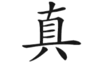
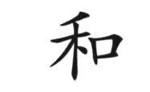
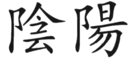

[Back](./)

[[1] *Der wunde Punkt*](#book1)  
[[2] *Ändere deine Gedanken - Die lebendige Weisheit des TAO*](#book2)  

&nbsp;

***

&nbsp;

 aus [1]:  

&nbsp;

> "Menschliche Größe besteht im wesentlichen aus der Fähigkeit, sich in den Umständen, in denen andere den Irrsinn wählen, für persönliche Erfüllung zu entscheiden."  

&nbsp;

[...] So halten wir jemanden für «intelligent», der über eine höhere schulische Ausbildung verfügt, der in einer der Wissensdisziplinen ein «As» ist – etwa in der Mathematik oder ganz allgemein den Naturwissenschaften, der über einen reichen Wortschatz verfügt, sich eigentlich überflüssige Fakten besonders gut merken kann oder vielleicht besonders schnell lesen kann. In den psychiatrischen Anstalten drängen sich jedoch neben den Kranken mit «normalem schulischem Werdegang» genauso viele Patienten, die über alle Zeugnisse der Gelehrsamkeit verfügen. Dagegen ist ein tatkräftiges, glückliches Leben, das jeden Tag und jeden einzelnen Augenblick eines jeden Tages auskostet, ein verläßlicherer Gradmesser für die Intelligenz des einzelnen.  

&nbsp;

> "Wenn Sie sich glücklich fühlen, wenn sie die Möglichkeiten des gegebenen Augenblicks voll ausschöpfen - dann sind Sie ein intelligenter Mensch."  

&nbsp;

[...] Das Lösen von Problemen kann außerdem zu Ihrem Wohlergehen beitragen; wenn Sie jedoch wissen, daß Sie, obwohl Sie eine bestimmte Schwierigkeit nicht zufriedenstellend lösen können, noch immer in der Lage sind, sich für ein glückliches Leben zu entscheiden oder sich zumindest nicht unglücklich fühlen müssen, dann sind Sie intelligent.  

[...] Wenn Sie Ihre Gedanken steuern und Ihre Gefühle wiederum aus Ihren Gedanken resultieren, dann können Sie auch Ihre Gefühle steuern, indem Sie nämlich die Gedanken beeinflussen, die ihnen vorausgehen. Einfach ausgedrückt: Sie meinen, manche Dinge oder manche Menschen würden Sie unglücklich machen; das stimmt aber nicht. Sie selbst machen sich unglücklich durch das, was Sie über die Menschen oder Dinge in Ihrem Leben denken! Ein freier, gesunder Mensch werden, das heißt lernen, anders zu denken. Wenn Sie erst Ihre Gedanken verändern können, werden bald Ihre neuen Gefühle zum Vorschein kommen.  

[...] Sie können sich also auf solche körperlichen Anforderungen wie das Erlernen der Koordination von Händen und Füßen beim Autofahren einstellen. Der gleiche Prozeß spielt sich im Bereich des Gefühlslebens ab, wenngleich er weniger bekannt ist. Ihre heutigen Gewohnheiten haben Sie erworben, indem Sie sie Ihr ganzes Leben hindurch eingeübt haben. Sie fühlen sich ganz automatisch unglücklich, ärgerlich, verletzt oder frustriert, weil Sie vor langer Zeit gelernt haben, in diesen Bahnen zu denken. Sie haben diese Verhaltensweisen akzeptiert und nie den Versuch gemacht, sie in Frage zu stellen. Genauso wie Sie diese selbstschädigenden Verhaltensweisen gelernt haben, können Sie auch lernen, sich nicht mehr unglücklich, ärgerlich, verletzt und frustriert zu fühlen.  

Solange Sie für sich selbst wertlos sind, solange Sie sich selbst nicht zu lieben vermögen, können Sie nicht wirklich geben. Wie sollte jemand, der wertlos ist, anderen Liebe schenken? Was wäre solche Liebe schon wert? Und wenn Sie schon keine Liebe geben können, können Sie erst recht keine empfangen. Was ist die Liebe wert, die von einem wertlosen Menschen kommt? Alles Geben und Nehmen, das ganze Drum und Dran der Liebe hat ein geliebtes eigenes Selbst ohne jede Abstriche zur Voraussetzung.  

Die gleiche Entscheidung können Sie für alle Ihre Selbstbilder treffen. So können Sie auch beschließen, sich für intelligent zu halten, indem Sie Ihren ganz persönlichen Maßstab an sich anlegen. Tatsächlich gilt:
>Je glücklicher Sie sich selbst machen können, desto intelligenter sind Sie.  

Schwächen, die Sie auf manchen Gebieten haben, zum Beispiel in Algebra, in der Rechtschreibung oder beim Formulieren, sind nichts anderes als die natürliche Folge von Entscheidungen, die Sie bisher getroffen haben. Sollten Sie sich jedoch entschließen, auf einem dieser Gebiete genügend lange zu üben, dann würden Sie zweifellos bessere Leistungen erzielen. Wenn Sie sich selbst nicht als sonderlich intelligenten Menschen ansehen, dann denken Sie daran zurück, was im ersten Kapitel gesagt worden ist. Der Grund, weshalb Sie sich selbst unterschätzen, liegt darin, daß Sie sich das haben einreden lassen und daß Sie sich im Hinblick auf bestimmte schulische Anforderungen mit anderen vergleichen. Sie können wählen, so intelligent zu sein, wie Sie wollen. Begabung ist wirklich mehr eine Funktion der Zeit als eine angeborene Eigenschaft.  

[...] Selbstliebe verlangt, daß Sie sich als wertvollen Menschen bejahen, weil Sie sich so entschieden haben. Bejahung bedeutet auch das Unterlassen von Klagen. Gesunde Menschen beklagen sich nicht, am allerwenigsten über die Härte der Steine, die Wolken am Himmel oder die Temperatur des Eises. Bejahung heißt, nicht zu klagen, und Glücklichsein heißt, sich nicht über Dinge aufzuhalten, die man nicht ändern kann. Anderen mitzuteilen, was Sie an sich selbst nicht leiden können, wird Ihre Unzufriedenheit kaum mindern, denn in den wenigsten Fällen haben Ihre Zuhörer eine andere Möglichkeit, als Ihnen zu widersprechen, und das wollen Sie ja nicht glauben. Genauso wie es nichts nützt, sich seiner Umgebung gegenüber zu beklagen, ist auch keinem damit gedient, wenn Sie es anderen erlauben, ihr eigenes Gepäck an Selbstmitleid und Elend bei Ihnen abzuladen.  

[...] Entlarven Sie die Eifersucht als Beleidigung Ihrer eigenen Person! Wenn Sie Vergleiche anstellen zwischen sich und einem anderen und sich vorstellen, Sie würden weniger geliebt, dann nehmen Sie den anderen wichtiger als sich selbst. Sie messen Ihre Vorzüge an denen eines anderen. Bedenken Sie indessen, daß ein anderer Mensch immer einen Dritten erwählen kann, ohne daß das mit Ihnen etwas zu tun hätte, und daß die Frage, ob ein für Sie wichtiger Mensch Sie wählt, keinesfalls zum Prüfstein Ihres Selbstwertes werden darf.  

[...] An dieser Stelle ist es wichtig, darauf hinzuweisen, daß kleine Kinder für ihre Entwicklung in hohem Maße auf Bejahung durch Bezugspersonen – meistens die Eltern – angewiesen sind. Aber die Bejahung sollte weder an die Sauberkeitserziehung geknüpft sein, noch sollte das Kind für alles, was es sagt, fühlt oder tut, die Genehmigung der Eltern einholen müssen. Selbstvertrauen kann schon in der Wiege gelehrt werden. Verwechseln Sie beim Lesen dieses Abschnitts das Bestätigungsbedürfnis nicht mit dem Liebesbedürfnis! Damit der einzelne als Erwachsener weitgehend unabhänig von der Bestätigung durch andere ist, ist es von Nutzen, ihm als Kind von Anfang an ein hohes Maß an Bestätigung zu geben. Wird ein Kind jedoch dazu erzogen, bei allem, was es denkt oder tut, erst Vater oder Mutter um Erlaubnis zu fragen, dann wird die Saat neurotischen Selbstzweifels schon früh gelegt. Hier ist von Bestätigungssuche als einem selbstschädigenden Bedürfnis die Rede, etwa wenn ein Kind darauf gedrillt wird, immer bei den Eltern nachzufragen. Es geht nicht um den gesunden Wunsch, von fürsorglichen Eltern Liebe und Bestätigung zu empfangen.  

[...] Sich ganz nach sich selbst zu richten, ohne das Bedürfnis nach Bestätigung durch eine äußere Macht, führt zur tiefsten religiösen Erfahrung, die es gibt. Es ist wahrhaftig eine Religion des Selbst, in der der einzelne sich in seinem Verhalten mehr durch sein Gewissen und die für ihn gültigen Gesetze seiner Kultur leiten läßt, als durch irgendwelche fremden Vorschriften, wie er sich verhalten sollte. Bei näherer Beschäftigung mit Jesus Christus finden wir einen im höchsten Grade selbstverwirklichten Menschen, einen Menschen, der Selbstvertrauen predigte und sich nicht scheute, Anstoß zu erregen. Nicht wenige seiner Anhänger haben seine Lehre allerdings zu einem Katechismus der Angst und des Selbsthasses verzerrt.  

[...] Wenn Sie auf Bestätigung versessen sind, ist der beste Weg, soviel wie möglich davon zu bekommen, also ironischerweise der, sie nicht zu wollen, es zu unterlassen, ihr nachzujagen und sie von niemandem zu verlangen. Sie werden dadurch, daß Sie mit sich selbst in Übereinstimmung leben und Ihr positives Selbstbild als Ratgeber benützen, viel mehr Anerkennung finden.  

Natürlich können Sie niemals bei jedermann und für alles, was Sie tun, Anerkennung ernten, aber wenn Sie sich selbst für wertvoll ansehen, wird das Ausbleiben von Anerkennung Sie nicht mehr niederdrücken. Mißbilligung wird Ihnen als die natürliche Folge des Lebens auf diesem Planeten erscheinen, dessen Bewohner sich in ihren Wahrnehmungen voneinander unterscheiden.  

[...] Selbstbeschreibungen sind nicht an sich schon nachteilig; sie können aber auf schädliche Weise angewendet werden. Allein die Tatsache, daß Sie sich überhaupt Schilder umhängen, kann sich für Ihr weiteres inneres Wachstum überaus hemmend auswirken. Nur zu leicht werden die Etiketten als Vorwand benützt, sich immer gleich zu bleiben. Sören Kierkegaard hat gesagt: «Sobald du mich festlegst, verneinst du mich.» Wenn das Individuum seiner Kennzeichnung gerecht werden muß, 90geht das Selbst zugrunde.  

«Es ist nicht das Erleben des Heute, das die Menschen in den Wahnsinn treibt. Es ist vielmehr die Reue über etwas, was gestern geschehen ist und die Furcht vor dem, was das Morgen enthüllen mag.»  

Das Auftreten von Schuldgefühlen und Sorgen können Sie überall beobachten, praktisch bei jedem Menschen, dem Sie begegnen. Es wimmelt auf der Welt von Leuten, die entweder Seelenqualen leiden wegen einer Tat, die sie nicht hätten tun sollen oder aber mutlos auf Dinge starren, die möglicherweise geschehen könnten. Vermutlich bilden Sie selbst keine Ausnahme. Für den Fall, daß Sie ausgeprägte Schuldgefühle und Sorgen haben, müssen Sie sie endgültig aus Ihrem Leben verbannen.  

[...] Der Mensch mit Innenkontrollpunkt legt sich die Verantwortung für das, was er empfindet, wacker auf die eigenen Schultern. So ein Mensch hat allerdings in unserer Kultur Seltenheitswert. Er gibt auf die obigen Fragen innenorientierte Antworten wie: «Ich sage mir die falschen Sachen vor», «Ich lege zuviel Wert auf das, was andere sagen», «Mich kümmert, was ein anderer denkt», «Ich bin im Augenblick nicht stark genug, um nicht unglücklich zu sein» und «Ich habe nicht das Geschick, mir die Niedergeschlagenheit zu ersparen». Befindet sich der Mensch, der innerlich im reinen ist, in einem Hoch, dann bringt er die entsprechenden «Ich»-Antworten vor, zum Beispiel: «Ich habe mir viel Mühe gegeben, glücklich zu sein», «Ich habe es fertiggebracht, mit fast allen Dingen gut zurechtzukommen», «Ich sage mir selbst das Richtige vor», «Ich leite mich selbst, und genau an diesem Punkt hier möchte ich stehen». Ein Viertel der Leute, so sehen wir, übernehmen also die Verantwortung für ihre Gefühle selbst, während drei Viertel äußeren Quellen die Schuld daran geben.  

[...] Hermann Hesse sagt in «Demian»:  

> «Wer zu bequem ist, um selber zu denken und selber sein Richter zu sein, der fügt sich eben in die Verbote, wie sie nun einmal sind. Andere spüren selber Gebote in sich, ihnen sind Dinge verboten, die jeder Ehrenmann täglich tut, und es sind ihnen andere Dinge erlaubt, die sonst verpönt sind. Jeder muß für sich selber stehen.»
&nbsp;

Wenn Sie sich genötigt fühlen, jederzeit alle Regeln zu befolgen, dann wartet ein Leben emotionaler Knechtschaft auf Sie. Unsere Kultur lehrt freilich, daß es ungezogen sei, nicht zu gehorchen und gegen die Regeln zu verstoßen. Deshalb kommt es darauf an, für sich selbst zu unterscheiden, welche Vorschriften sinnvoll und zur Aufrechterhaltung der Ordnung in der Welt notwendig sind, und welche ohne Schaden für Sie und andere übertreten werden können. Rebellion um ihrer selbst willen zahlt sich nicht aus; aber sein eigener Mensch sein und sein Leben nach eigenen Maßstäben leben, bringt reichen Lohn.  

Sie sind nicht unbedingt das, was Sie zu sein vorgeben. Viel besser als Worte zeigt Ihr Verhalten, wer Sie sind. Nur an dem, was Sie in Ihren gegenwärtigen Augenblicken tun, läßt sich ablesen, wer Sie als Mensch sind.  

&nbsp;

>In jedem Verhältnis, in dem zwei Menschen eins werden, ist das Endergebnis zwei halbe Menschen.

&nbsp;

[...] Was wünschen Sie sich für Ihre Kinder? Sähen Sie sie gern voller Selbstachtung und Selbstvertrauen, frei von Neurosen, erfüllt und glücklich? Ja, natürlich wäre Ihnen das lieb. Was aber können Sie dafür tun? Ganz einfach: selbst so sein. Kinder lernen aus dem Verhalten ihrer Vorbilder. Sie führen Ihre Kinder hinters Licht, wenn Sie selbst voller Schuldgefühle stecken und in Ihrem Leben unerfüllt sind, ihnen jedoch einbleuen, ganz anders zu werden. Wenn Sie ihnen Ihre niedrige Selbsteinschätzung vorleben, unterweisen Sie Ihre Kinder darin, die gleiche Haltung einzunehmen. Und was noch schwerer wiegt: Ihren Kindern ist keineswegs gedient, wenn Sie sie wichtiger nehmen als sich selbst; sie lernen dadurch bloß, anderen immer den Vortritt zu lassen, unerfüllt zu bleiben und sich mit dem zweiten Platz zu begnügen. Was für eine Ironie! Sie können Ihren Kindern Selbstvertrauen nicht einfach in die Hand drücken; die Kinder müssen es selbst aufbauen, indem sie sich nach Ihrem Beispiel richten. Nur wenn Sie sich selbst als den wichtigsten Menschen behandeln und sich nicht fortwährend für Ihre Kinder aufopfern, können Sie sie lehren, auf sich selbst zu vertrauen und an sich selbst zu glauben.  

[...] In so einer Familie gibt es keine raffinierte Manipulation der Kinder mittels Schuldgefühlen und Drohungen, um ihre Abhängigkeit und Verantwortlichkeit den Eltern gegenüber aufrechtzuerhalten. Den Eltern liegt nichts daran, daß ihre Kinder sie aus Pflichtgefühl besuchen kommen. Sie sind überdies viel zu sehr damit beschäftigt, auf ihre Weise aktiv zu sein, um herumzusitzen und darauf zu warten, daß ihre Kinder und Enkel auftauchen und ihnen einen Grund zum Leben liefern. Solche Eltern finden es nicht richtig, ihren Kindern alle Steine aus dem Weg zu räumen, über die sie selbst früher gestolpert sind, weil ihnen bewußt ist, daß sie ihr Selbstvertrauen und ihre Selbstachtung eben gerade der Auseinandersetzung mit den Härten des Lebens zu verdanken haben. So wertvolle Erfahrungen würden sie ihren Kindern nicht vorenthalten wollen.  

Eltern solchen Schlages verstehen den Wunsch ihrer Kinder, ihren Kampf allein zu führen – zwar mit elterlichem Beistand, aber ohne ihr Übergewicht –, als gesundes Streben, das ihnen nicht verwehrt werden sollte. Über die Vielfalt der Wege zur Unabhängigkeit sagt Hesses Demian:  

«Jeder von uns muß einmal den Schritt tun, der ihn von seinem Vater, von seinen Lehrern trennt, jeder muß etwas von der Härte der Einsamkeit spüren … Von meinen Eltern und ihrer Welt, der ‹lichten› Welt meiner schönen Kindheit, war ich nicht in heftigem Kampf geschieden, sondern langsam und fast unmerklich ihnen ferner gekommen und fremder geworden. Es tat mir leid, es machte mir bei den Besuchen in der Heimat oft bittere Stunden …»  
&nbsp;

[...] Ärger ist mehr als Verdrießlichkeit oder Gereiztheit. Wieder einmal ist «Unbeweglichkeit» das Schlüsselwort: Ärger wirkt lähmend; er entsteht normalerweise aus dem Wunsch, die Welt und die Menschen auf der Welt möchten anders sein, als sie in Wirklichkeit sind.  

Ärger ist sowohl eine Entscheidung als auch eine Gewohnheit. Er stellt eine erlernte Reaktion auf Frustration dar, wobei Sie sich auf eine Art und Weise verhalten, mit der Sie selbst nicht voll einverstanden sind. Heftiger Ärger ist in der Tat eine Spielart der geistigen Umnachtung: Geistig umnachtet ist, wer sein Verhalten nicht unter Kontrolle hat; wenn Sie vor Ärger außer sich geraten, sind Sie logischerweise zeitweilig geistig umnachtet.  

Auf Ärger steht keinerlei psychische Belohnung. So wie wir ihn hier verstehen, wirkt er schwächend. Er kann im psychosomatischen Bereich zu erhöhtem Blutdruck, Magengeschwüren, Hautausschlägen, Herzklopfen, Schlaflosigkeit, Erschöpfungszuständen und sogar zu Herzbeschwerden führen. In psychologischer Hinsicht zerstört Ärger Liebesbeziehungen, beeinträchtigt die Kommunikation, zieht Schuldgefühle und Depressionen nach sich und wirkt ganz allgemein als Störfaktor. Mag sein, daß das alles bei Ihnen auf Skepsis stößt, da Sie doch immer wieder gehört haben, wieviel gesünder es sei, seinem Ärger Luft zu machen, als ihn zurückzudrängen. Selbstverständlich ist es gesünder, seinen Ärger zu zeigen als ihn zu unterdrücken. Aber es gibt da ja noch einen gesünderen Standpunkt: ihn gar nicht erst aufkommen lassen!  

[...] Ihre Beziehungen gründen sich stets auf das Recht jedes Partners, für sich selbst zu entscheiden. Diese Menschen können einen anderen lieben, ohne ihm ihre Werte aufzwingen zu wollen. Ihr Privatbereich liegt ihnen sehr am Herzen, so daß bei anderen manchmal das Gefühl entstehen kann, vor den Kopf gestoßen oder zurückgewiesen zu werden. Zuzeiten sind sie gern allein, und sie setzen sehr viel daran, sicherzustellen, daß ihre Privatsphäre respektiert wird. Sie werden diese Menschen nicht in zahlreiche Liebesbeziehungen verstrickt finden. Mit ihrer Liebe gehen sie wählerisch um, lieben jedoch andererseits tief und empfindsam. Für abhängige oder kranke Menschen ist es schwierig, solche Menschen zu lieben, da sie sich von ihrer Freiheit nichts abhandeln lassen. Wenn ein anderer sie braucht, weisen sie ein solches Bedürfnis als für den anderen wie sich selbst schädlich zurück. Sie möchten, daß die, die sie lieben, unabhängig sind, ihre Entscheidungen selbständig treffen und ihr eigenes Leben leben. Obwohl sie andere mögen und gern mit ihnen zusammen sind, ist ihnen noch viel mehr daran gelegen, daß die anderen ohne Krücken und Anlehnen zurechtkommen. Noch im gleichen Augenblick, in dem Sie sich an einen dieser Menschen anzulehnen beginnen, können Sie erleben, wie er sich von Ihnen entfernt – zuerst emotional, dann auch physisch. Sie lassen sich in reifen Beziehungen weder auf Abhängigkeit ein, noch darauf, daß ein anderer von ihnen abhängig wird. Kindern gegenüber sind sie das Musterbild eines treusorgenden Erwachsenen, fördern jedoch vom ersten Tag an ihr Selbstvertrauen und geben ihnen gleichzeitig beständig sehr viel Liebe.  

Sie werden bei diesen glücklichen, erfüllten Menschen auf einen außergewöhnlichen Mangel an Bestätigungsstreben stoßen. Sie können sehr gut ohne die Bestätigung und den Beifall von anderen auskommen. Im Gegensatz zur großen Mehrheit der Menschen drängen sie sich nicht nach Ruhm und Ehre. Statt dessen sind sie ungewöhnlich unabhängig von fremden Ansichten und machen sich so gut wie keine Sorgen darum, ob ihre Worte oder Taten bei anderen wohl auch Anklang finden werden. Es ist ihnen weder darum zu tun, andere zu schockieren, noch darum, ihre Zustimmung zu erlangen. Diese Menschen sind in so hohem Maße innengeleitet, daß fremde Einschätzung ihres Verhaltens sie buchstäblich nicht berührt. Natürlich sind sie Lobsprüchen und Beifall gegenüber nicht taub; es scheint ihnen eben bloß jedes Bedürfnis danach zu fehlen. Sie können fast grob werden in ihrer Ehrlichkeit, da sie ihre Aussagen nicht in sorgfältig formulierte, auf Gefallen berechnete Wendungen kleiden. Fragen Sie sie, was sie denken – und Sie werden genau das zu hören bekommen.  

[...] Solche Menschen können sich in das Verhalten anderer hineinversetzen. Was anderen oft als komplex und undurchschaubar erscheint, sieht in ihren Augen klar und verständlich aus. Die Probleme, die so viele Leute lähmen, werden von ihnen häufig nur als kleinere Unannehmlichkeiten betrachtet. Weil sie sich dadurch gefühlsmäßig nicht mitnehmen lassen, werden sie fähig, Schranken zu übersteigen, die für die meisten immer unüberwindlich bleiben. Ihr eigenes Verhalten ist ihnen gleichermaßen einsichtig, und sie erkennen auch sofort, was andere gegen sie im Schilde führen. Sie können jedoch einfach mit den Achseln zucken und darüber hinweggehen, wo andere mit Ärger und Unbeweglichkeit reagieren. Niemals sind sie verblüfft oder verunsichert. Dinge, die den meisten anderen verwirrend oder unlösbar erscheinen, sehen sie als ganz simple Sachverhalte mit naheliegenden Lösungen. In ihrem Gefühlsleben sind sie nicht auf Probleme konzentriert. Für sie steht ein Problem nicht automatisch in direkter Beziehung mit dem, was sie als Menschen sind oder auch nicht sind; es ist tatsächlich nichts weiter als ein zu überwindendes Hindernis. Da ihr Selbstwert seinen Sitz in ihrem Innern hat, können sie alle äußeren Belange objektiv betrachten und nicht als wie auch immer gearteten Angriff auf ihre Persönlichkeit. Dies ist ein sehr schwer zu verstehender Zug, da sich doch die meisten Menschen durch äußere Ereignisse, Ideen oder Menschen sehr rasch bedroht fühlen. Gesunde, unabhängige Leute wie sie wissen jedoch gar nicht, wie sie sich bedroht fühlen sollten. Vielleicht ist es gerade dieses charakteristische Merkmal, das sie für andere bedrohlich macht.  

&nbsp;

 aus [2]:  
&nbsp;  

## 1  
*Das Tao, das mitgeteilt werden kann,  
ist nicht das ewige Tao.  
Der Name, der genannt werden kann,  
ist nicht der ewige Name.  
Das Tao ist sowohl benannt wie namenlos.  
Das Namenlose ist der Ursprung aller Dinge,  
als Benanntes ist es die Mutter der zehntausend Dinge.  
Stets frei von Wünschen, erkennst du klar das Geheimnis.  
Stets in Wünschen verstrickt, siehst du nur die Erscheinungsformen.  
Doch das Geheimnis selbst ist das Tor  
zu allem Verstehen.*  

  
&nbsp;  

## 2
*Unter dem Himmel sehen alle Schönheit nur deshalb als schön, weil es Hässliches gibt.  
Alle erkennen Gutes nur deshalb als gut, weil es Böses gibt.*  

*Sein und Nichtsein erzeugen einander.  
Das Schwierige entsteht aus dem Leichten.  
Lang und kurz bestimmen einander wie hoch und niedrig.  
Vorher und nachher folgen einander.  
Daher lebt der Weise offen mit scheinbarer Dualität und paradoxer Einheit.  
Der Weise handelt ohne Mühe und lehrt ohne Worte.  
Pflegt Dinge, ohne sie zu besitzen,  
arbeitet, doch nicht gegen Lohn,  
wetteifert, doch nicht für ein Ergebnis.*  

*Wenn das Werk getan ist, ist es vergessen.  
Daher währt es ewig.*  

  
&nbsp;  

## 3  
*Wird Stellung Wert beigemessen,  
entsteht Streitsucht  
Steht Besitz zu hoch im Kurs,  
beginnen die Menschen zu stehlen.  
Begehrenswertes nicht zeigen, so macht man,  
dass des Volkes Herz nicht wirr wird.*  

*Der Weise herrscht also:  
Er leert Geist und Herz,  
er schwächt den Ehrgeiz und stärkt die Knochen.*  

*Übe dich im Nichttun.  
Ist das Handeln rein und selbstlos,  
findet alles seinen vollkommenen Platz.*  

  
&nbsp;  

## 4  
*Das Tao ist leer,  
doch unerschöpflich,  
bodenlos,  
der Ahne von allem.*  

*In ihm werden scharfe Kanten rund,  
verschlungene Knoten lösen sich,  
die Sonne wird weicher durch eine Wolke,  
der Staub setzt sich.*  

*Es ist verborgen, doch immer da.  
Ich weiß nicht, wer es gebar.  
Es scheint der gemeinsame Ahne von allem zu sein, der Vater der Dinge.*  

  
&nbsp;  

Bleiben Sie heute in einer beliebigen Situation still, statt verbal zu reagieren, und achten Sie auf ihre Gedanken. Beschließen Sie beispielsweise bei einem geselligen Beisammensein oder in einer geschäftlichen Runde, die Leere zu suchen, sie sich in der Stille findet, um sich Ihres unendlichen Selbst bewusst zu werden. Bitten Sie dieses, Sie wissen zu lassen, wann und ob Sie antworten sollen. Wenn Sie merken, wie Ihr weltliches Ego deutet oder urteilt, so beobachten Sie es einfach, ohne es zu kritisieren oder zu verändern. Es werden Ihnen immer mehr Situationen auffallen, in denen nicht zu reagieren sich friedlich und freudig anfühlt. Verweilen Sie stattdessen in der verborgenen, jedoch stets gegenwärtigen Unendlichkeit.  
Vielleicht schreiben Sie sich den folgenden Rat meines Lehrers Nisargadatta Maharaj ab und hängen ihn gut sichtbar auf, damit Sie ihn jeden Tag lesen können:  
>Weisheit heißt erkennen, dass ich nichts bin,  
Liebe heißt lernen, dass ich alles bin,  
und zwischen den beiden bewegt sich mein Leben.  

&nbsp;

## 5  
*Himmel und Erde sind unvoreingenommen.  
Sie sehen die zehntausend Dinge als Strohhunde.  
Der Weise ist nicht sentimental,  
er behandelt sein ganzes Volk wie Strohhunde.*  

*Der Weise ist wie Himmel und Erde:  
ihm ist keiner besonders lieb,  
noch missbilligt er jemanden.  
Er gibt und gibt bedingungslos  
und bietet seine Schätze allen an.*  

*Zwischen Himmel und Erde  
ist ein Raum wie ein Blasebalg,  
leer und unerschöpflich,  
je mehr er genutzt wird, desto mehr bringt er hervor.*  

*Halte am Mittelpunkt fest.  
Der Mensch wurde gemacht, still dazusitzen und  
die Wahrheit im Innern zu finden.*  

  
&nbsp;  

Geht Ihnen ein Gedanke durch den Kopf, der andere ausschließt, so wollen Sie als »besonders« und damit als jemand gelten, der außerordentliche Gunst von seinem Seinsursprung verdient. Haben Sie sich erst einmal in diese Kategorie eingeordnet, so finden Sie sich wichtiger als andere, die Sie als weniger verdienstvoll einschätzen. Ein solches Denken bewirkt, dass Sie die allumfassende Macht des Tao verlieren. Organisationen — einschließlich religiöser —, die einige Mitglieder als »bevorzugt« bezeichnen, sind nicht im Tao zentriert. Egal, wie sehr Sie sich bemühen, sich und andere von Ihrer spirituellen Verbundenheit zu überzeugen, so hat der Akt des Ausschlusses und der Voreingenommenheit bereits verhindert, dass Sie aus Ihrem wahren Selbst heraus handeln. Das heißt: Wenn ein Gedanke oder Verhalten uns trennt, kommt es nicht von Gott; wenn es uns verbindet, ist es von Gott. Bleiben Sie auf das Tao ausgerichtet, das in Ihnen wohnt, rät Laotse, und Sie werden keinen einzigen Gedanken haben, der nicht im Einklang mit dem Geist wäre.  
&nbsp;

## 6  
*Den Geist, der niemals stirbt  
nennt man geheimnisvoll Weibliches.  
Auch wenn es zum ganzen Universum wird,  
geht seine unbefleckte Reinheit nie verloren.  
Auch wenn es zahllose Formen annimmt,  
bleibt seine wahre Identität intakt.*  

*Das Tor zum geheimnisvoll Weiblichen  
nennt man die Wurzel der Schöpfung.*  

*Höre auf ihre Stimme,  
höre ihr Echo in der ganzen Schöpfung.  
Ohne Fehl offenbart sie ihre Gegenwart.  
Ohne Fehl führt sie zur eigenen Vollkommenheit.  
Auch wenn sie unsichtbar ist, dauert sie fort,  
sie wird niemals enden.*  

  
&nbsp;

## 7  
*Der Himmel ist ewig - die Erde von Dauer.  
Weshalb sind Himmel und Erde ewig von Dauer?  
Sie leben nicht nur für sich selbst.  
Dies ist das Geheimnis ihrer Dauerhaftigkeit.*  

*Deshalb setzt sich der Weise hintan,  
so endet er vorne.  
Er bleibt Zeuge des Lebens,  
so ist er von Dauer.*  

*Diene den Bedürfnissen anderer,  
so werden all deine eigenen Bedürfnisse gestillt.  
Selbstloses Handeln bringt Erfüllung.*  

  
&nbsp;  

## 8  
*Das höchste Gut ist wie das Wasser,  
das alle Dinge nährt, ohne sich zu bemühen.  
Es fließt an niedrige Orte, die Menschen verabscheuen.  
Somit gleicht es dem Tao.*  

*Lebe in Übereinstimmung mit der Natur der Dinge.  
Beim Wohnen: bleibe erdnah. Beim Meditieren: geh tief in dein Herz.  
Im Umgang mit anderen: Sei sanft und gütig.  
Halte dein Wort.  
Herrsche gerecht.  
Sei zeitgemäß und wähle den richtigen Zeitpunkt.*  

*Wer in Übereinstimmung mit der Natur lebt,  
läuft dem Wesen der Dinge nicht zuwider.  
Er bewegt sich in Harmonie mit dem Augenblick  
und kennt stets die Wahrheit dessen, was zu tun ist.*  

  
&nbsp;

## 9  
*Immer weiter füllen  
ist nicht so gut wie aufhören.  
Überfüllt, tropft es aus hohler Hand,  
es ist besser, nicht mehr einzugießen.*  

*Schärfe das Messer zu oft,  
und seine Klinge wird bald stumpf.  
Fülle dein Haus mit Jade und Gold,  
und es bringt Unsicherheit.  
Plustere dich auf mit Ehre und Stolz,  
und niemand kann dich retten vor dem Fall.*  

*Zieh dich zurück ist das Werk getan,  
dies ist der Weg des Himmels.*

  
&nbsp;

## 10  

*Kannst du Körper und Seele haben,  
das Eine umfassen  
und Trennung vermeiden?*  

*Kannst du deinen Körper so geschmeidig werden lassen  
wie den eines neugeborenen Kindes?  
Kannst du beim Öffnen und Schließen der Himmelspforte  
die weibliche Rolle spielen?*  

*Kannst du dein Volk lieben  
und dein Reich beherrschen,  
ohne dich wichtig zu finden?*  

*Hervorbringen und nähren,  
haben, doch nicht besitzen,  
arbeiten, doch kein Lob erwarten,  
führen, ohne Kontrolle zu üben oder zu dominieren.*  

*Wer auf diese Kraft achtet,  
bringt das Tao in die Welt.  
Das ist die höchste Tugend.*  

  
&nbsp;  

## 11  
*Dreißig Speichen laufen in einer einzigen Nabe zusammen.  
Vom Loch in der Mitte hängt  
die Brauchbarkeit des Wagens ab.*  

*Forme Ton zu einem Gefäß.  
Der leere Raum darin macht es brauchbar.  
Brich schöne Türen und Fenster heraus,  
doch die Leere macht das Zimmer brauchbar.*  

*Die Brauchbarkeit dessen, was ist,  
hängt von dem ab, was nicht ist.*  

  
&nbsp;  

**Üben Sie täglich die Macht der Stille**  
Es gibt viele verschiedene Arten, dies auf persönliche Weise zu tun. Meditieren beispielsweise ist ein wunderbares Mittel, Ihnen zu jener Glückseligkeit zu verhelfen, die entsteht, wenn Sie mit Ihrer inneren Leere verbunden sind, mit jenem Ort, an dem Sie den Weg des Tao erfahren. Geloben Sie, sich des >>ortlosen Ortes<< in sich bewusster zu werden, aus dem alle Gedanken entspringen und nach außen fliehen. Finden Sie ihre eigene Weise den Raum in sich zu betreten, der sauber, rein und im Einklang mit der Liebe ist.  
Der Unterschied zwischen Heiligen und der übrigen Menschheit besteht darin, dass sie liebevolle, reine Überzeugungen haben, wir hingegen nicht. Sie wirken ausschließlich aus ihrem Kern, von wo aus der Weg des Tao unsichtbar ihr körperliches Sein durchströmt. Das ist das erste Ziel, wenn Sie lernen, zu meditieren oder in der Stille zu sein: Ihre Essenz zu bitten, sich zu offenbaren und Sie in der Leere leben zu lassen.  
&nbsp;

## 12  
*Die fünf Farben machen das Auge blind.  
Die fünf Töne machen das Ohr taub.  
Die fünf Gewürze stumpfen den Geschmackssinn ab.  
Rennen und Jagen machen den Geist der Menschen verrückt.*  

*Energie zum Erlangen seltener Gegenstände zu vergeuden  
hemmt nur das eigene Wachstum.*  

*Der Meister beobachtet die Welt,  
vertraut aber auf seine innere Vision.  
Er lässt die Dinge kommen und gehen.  
Er zieht das, was innen ist, dem vor, was außen ist.*  

  
&nbsp;  

## 13  
*Gunst und Ungnade erscheinen erschreckend.  
Eine hohe Stellung setzt dir sehr zu.*  

*Weshalb sind Gunst und Ungnade erschreckend?  
Gunst suchen ist erniedrigend:  
erschreckend, wenn sie erlangt ist,  
erschreckend, wenn sie verloren geht.*  

*Weshalb setzt eine hohe Stellung dir sehr zu?  
Wir haben deswegen viele Probleme,  
weil wir ein Ich haben.  
Hätten wir kein Ich,  
welche Schwierigkeiten hätten wir dann?*  

*Das wahre Selbst des Menschen ist ewig,  
doch er denkt: Ich bin dieser Körper und werde bald sterben.  
Wenn wir keinen Körper haben, welches Unheil kann uns heimsuchen?  
Wer sich als alles sieht,  
taugt, Hüter der Welt zu sein.  
Wer sich selbst liebt wie alle,  
taugt, Lehrer der Welt zu sein.*  

  
&nbsp;  

Der dreizehnte Spruch besagt klipp und klar: Das Ego und das Bedürfnis, wichtig zu sein, sind Störenfriede, die von ihrem weltlichen Ich ständig mit Energie versorgt werden. Der Weg des Tao besteht darin, sich ihres ewigen Wesens bewusst zu sein und aus Ihrem Ich oder Körper herauszutreten. Kein Ego zu haben bedeutet keine Schwierigkeiten zu haben. Ein großes Ego hingegen bringt große Schwierigkeiten. Das Tao Te King stellt die rhetorische Frage: >>Wenn wir keinen Körper haben, welches Unheil kann uns dann heimsuchen?<< Wenn Sie sich selbst diese Frage stellen, werden Sie eine göttliche, unsichtbare Seele entdecken, die unabhängig von den Meinungen all dieser gequälten Suchenden ist, die unsere Welt bevölkern. Wenn Sie im Geist des Tao leben, wird Ihre wahres Wesen das Trachten nach äußerer Gunst durch das Bewusstsein ersetzen, dass das, was andere über Sie denken, Sie wirklich nicht zu kümmern braucht!   
&nbsp;

## 14  
*Was nicht zu sehen ist, heißt unsichtbar.  
Was nicht zu hören ist, heißt unhörbar.  
Was nicht zu halten ist, heißt unfassbar.  
Diese drei lassen sich nicht bestimmen,  
dabei verschmelzen sie in eines.*  

*Jedes der drei ist zu subtil, um es zu beschreiben.  
Durch Intuition kannst du es sehen,  
hören  
und fühlen.  
Dann sind das Unsichtbare,  
Unhörbare  
und Unfassbare  
als eines da.*  

*Es geht und bringt keine Dämmerung,  
es geht unter und bringt keine Dunkelheit,  
es geht immer, unnennbar, weiter,  
und kehrt ins Nichts zurück.*  

*Nähere dich ihm: da ist kein Anfang.  
Folge ihm: da ist kein Ende.  
Du kannst es nicht kennen, aber es sein,  
lebe gelassen dein Leben.*  

*Entdecken, wie die Dinge stets waren,  
bringt im Einklang mit dem Weg.*  

  
&nbsp;  

Manche Gelehrte haben den vierzehnten Spruch des Tao Te King als den wichtigsten unter den insgesamt einundachtzig hervorgehoben, weil er die Bedeutung des einen Grundsatzes unterstreicht, der dem gesamten Dasein zugrunde liegt. Wenn Sie diese unsichtbare, unfassbare, unermessliche Kraft anzapfen, können Sie jene Harmonie erlangen, die mit der Verbindung mit dem Einssein einhergeht. Harmonie aber ist ihr letztendliches Ziel, wenn Sie sich dazu entscheiden, ein ver-Geist-igtes Leben zu führen. Sie möchten ihr Ego aufgeben lernen, das sich mit der Welt der Dinge, des Besitzes und der Leistungen identifiziert, und wieder an den ortlosen Ort gelangen, aus dem Sie und alle anderen hervorgegangen sind. Dadurch erlangen Sie die mystischen, ja nahezu magischen Kräfte Ihres ewigen Seinsursprungs. Dort leben Sie jenseits der Welt der Formen.  
Wenn sie ausschließlich >>in der Form<< leben, konzentrieren Sie sich darauf, In-Form-ationen zu sammeln. Der vierzehnte Spruch des Tao fordert Sie auf, in Inspirationen statt Informationen einzutauchen und eins mit dem zu werden, was immer war. Wie dieser Spruch des Tao so einsichtsvoll schließt: >>Entdecken, wie alles stets war, bringt im Einklang mit dem Weg.<<
&nbsp;  

## 15
*Die alten Meister waren tiefgründig und feinsinnig.  
Ihre Weisheit war so unergründlich,  
sie lässt sich gar nicht beschreiben.  
Das Einzige, was wir beschreiben können, ist ihr Erscheinen.*  

*Vorsichtig wie jemand, der winters einen Bach überquert.  
Wachsam wie Gefahr witternde Männer.  
Einfach wie unbehauenes Holz.  
Hohl wie eine Höhle.  
Nachgiebig wie schmelzendes Eis.  
Amorph wie trübes Wasser.*  

*Doch das trübste Wasser wird klar,  
wenn es still wird.  
Aus dieser Ruhe  
entsteht das Leben.*  

*Wer das Tao bewahrt, begehrt nicht Fülle.  
Doch eben weil er nie voll ist, kann er bleiben wie ein verborgener Keim  
und beeilt sich nicht, frühzeitig zu reifen.*  

  
&nbsp;  

## 16
*Werde völlig leer.  
Lass dein Herz in Frieden sein.  
Sieh, wie im Getümmel weltlichen Kommens und Gehens  
ein Ende zum Anfang wird.*  

*Alles erblüht, eins um eins,  
nur um zum Ursprung zurückzukehren -  
zu dem, was ist und sein wird.*  

*Zur Wurzel zurückzukehren heißt Frieden finden.  
Frieden finden heißt seine Bestimmung erfüllen.  
Seine Bestimmung erfüllen heißt beständig sein.  
Das Wissen vom Beständigen nennt man Einsicht.  
Diesen Kreislauf nicht zu kennen  
führt zu ewigen Unglück.*  

*Das Wissen vom Beständigen verleiht Perspektive.  
Diese Perspektive ist unvoreingenommen.  
Unvoreingenommenheit ist die höchste Vornehmheit.  
Die höchste Vornehmheit ist göttlich.*  

*Da du göttlich bist, wirst du eins mit dem Tao sein.  
Eins mit dem Tao sein währt ewig.  
Dieser Weg ist ewig,  
kein physischer Tod gefärdet ihn.*  

  
&nbsp;

## 17
*Ist der größte Führer an der Spitze,  
weiß das Volk kaum, dass er da ist.  
Darunter steht einer, den sie lieben undloben.  
Darunter steht einer, den sie fürchten.  
Darunter steht einer, den sie verachten, dem sie trotzen.*  

*Vertraut ein Führer niemandem,  
vertraut ihm niemand.*  

*Der große Führer redet wenig  
und nie unüberlegt.  
Er arbeitet ohne Eigeninteresse  
und hinterlässt keine Spur.  
Wenn alles beendet ist, sagt das Volk:  
"Wir haben es ganz alleine vollbracht."*  

  
&nbsp;  

Der Rat im siebzehnten Spruch richtet sich an Anführer jeder Art. Sie können das Wort 'Führer' durch 'Eltern' oder 'Lehrer' ersetzen, dann betrifft es Sie persönlicher. Überdenken Sie, wie Sie Ihr eigenes Vorgehen sehen und nehmen Sie die nötigen Veränderungen vor, um jemand zu werden, der das Leben anderer erhellt und günstig beeinflusst. Erstens müssen Sie im Hintergrund bleiben und achtsamer Beobachter des Geschehens werden. Dann fragen Sie sich, wie Sie ohne Einmischung ein Umfeld schaffen können, das allen zu verantwortungsbewusstem Handeln verhilft.  
Das Tao rät, möglichst unsichtbar zu bleiben, wenn Sie ein wirklich effizienter Führer sein wollen. [...] Wirklich beflügelnde Führer erzielen Ergebnisse durch das eigene Vorbild. Sie ermutigen andere, Verantwortung zu übernehmen und das Richtige zu tun, jedoch nicht durch Verkünden und Prahlen, wie unanfechtbar ihr Anweisungen sind. Sie schaffen Raum, damit andere sich inspirieren lassen und zu ihrer eigenen Größe finden können. Der größte taoistische Anführer lässt andere stets die eigene Lebensart und Auffassung vom Guten suchen und finden. Ein aufgeklärter Führer betrachtet sich nicht als selbst ernannter Gebieter. Vielmehr erhöht er die Energie seines Umfelds durch eine Sichtweise, die niedere Neigungen auf ein höheres Niveau hebt.  
&nbsp;

## 18  
*Ist die Größe des Tao da,  
fließt das Tun aus dem eigenen Herzen.  
Fehlt die Größe des Tao,  
kommt das Tun von den Regeln  
der >>Freundlichkeit und Gerechtigkeit<<.*  

*Braucht man Regeln für Freundlichkeit und Gerechtigkeit,  
und handelt man tugendhaft,  
so ist dies ein sicheres Zeichen für fehlende Tugend.  
Daher sieht man viel Heuchelei.*  

*Werden Verwandte uneins,  
entstehen Frömmigkeit und Andachtsriten.  
Gerät das Land in Chaos,  
erscheinen offizielle Getreue,  
Vaterlandsliebe entsteht.*  

  
&nbsp;

## 19  
*Gib Heiligkeit auf, verzichte auf Weisheit,  
und es wird hundertmal besser für alle sein.  
Wirf Moral und Gesetze ab,  
und die Menschen werden das Richtige tun.  
Wirf Ehrgeiz und Gewinnsucht ab,  
und es wird keine Diebe geben.*  

*Das alles sind nur äußere Formen,  
sie allein reichen nicht aus.*  

*Wichtiger ist es,  
die Einfachheit zu sehen,  
das eigene wahre Wesen zu erkennen,  
Selbstsucht abzulegen  
und Wünsche zu zügeln.*  

  
&nbsp;  

## 20  
*Gib Gelehrsamkeit auf, und du bist frei von allen Sorgen.  
Was ist der Unterschied zwischen Ja und Nein?  
Was ist der Unterschied zwischen Gut und Böse?*  

*Muss ich fürchten, was andere fürchten?  
Soll ich Trostlosigkeit fürchten,  
wenn es Fülle gibt?  
Sollte ich Dunkelheit fürchten,  
wenn überall Licht erstrahlt?*  

*Manche gehen im Frühjahr in den Park und steigen auf Terrassen,  
nur ich allein lasse mich treiben, weiß nicht, wo ich bin.  
Wie ein neugeborenes Kind, bevor es das Lachen lernt,  
bin ich allein, nirgends ein Ort hinzugehen.*  

*Die meisten haben mehr, als sie brauchen,  
nur mir allein scheint etwas zu fehlen.  
Ich habe den Verstand eines Unwissenden  
in seiner ungetrübten Einfachheit.  
Ich bin nur ein Gast auf dieser Welt.  
Wo sich andere abhetzen, um Dinge zu erledigen,  
nehme ich an, was angeboten wird.  
Nur ich allein bin anscheinend ein Tor,  
verdiene wenig, gebe weniger aus.*  

*Andere streben nach Ruhm.  
Ich vermeide das Rampenlicht und  
bleibe lieber allein.  
Ich bin in der Tat wie ein Dummkopf:  
kein Verstand, keine Sorgen.*  

*Ich treibe dahin wie die Wellen des Meeres,  
richtungslos wie der Wind.*  

*Jedermann findet seine Nische,  
nur ich allein bleibe dickköpfig draußen.  
Doch am meisten unterscheide ich mich von andern im Wissen,  
Nahrung zu finden bei der großen Mutter.*  

  
&nbsp;

Seien Sie sowohl geistig als auch körperlich präsent, in einer Grundhaltung der Wertschätzung und ohne Sehnsucht. Fragen Sie sich nicht mehr, ob Sie das Richtige tun. Vergessen Sie jedes: >>Was ist wenn...?<< und sämtliche Zukunftsziele und ersetzen Sie diese durch die Macht des Augenblicks. Seien Sie hier und denken Sie daran, dies jetzt zu tun, denn in Gedanken schon anderswo zu sein zehrt Ihre wertvolle Gegenwartsmomente auf. Der erleuchtete Weise übt, vollständig im momentanen >>Jetztsein<< seines Lebens aufzugehen.  
&nbsp;  

## 21  
*Dies ist die größte Tugend: dem Tao nur dem Tao zu folgen.*  

*Das Tao ist schwer fassbar und nicht zu griefen.  
Obwohl formlos und nicht zu greifen,  
bringt es Formen hervor.  
Obwohl unbestimmt und flüchtig,  
bringt es Gestalten hervor.  
Obwohl dunkel und undeutlich,  
ist es der Geist, die Essenz,  
der Lensodem alles Dinge.*

*Durch alle Zeitalter hindurch wurde sein Name erhalten,  
um den Anfang aller Dinge in Erinnerung zu rufen.  
Wie weiß ich um die Art aller Dinge am Anfang?  
Ich blicke in mein Inneres und sehe, was in mir ist.*  

  
&nbsp;

## 22  
*Was flexibel ist, bleibt ungebrochen.  
Was krumm ist, wird gerade.  
Was leer ist, wird gefüllt.  
Wer erschöpft ist, wird erneuert.  
Wer arm ist, wird bereichert.  
Wer reich ist, dem wird genommen.  
Darum umfängt der Weise das Eine.  
Weil er sich nicht zur Schau stellt,  
sehen die Menschen sein Licht.  
Weil er nichts zu beweisen braucht,  
können sie seinen Worten vertrauen.  
Weil er nicht weiß, wer er ist,  
erkennen sie sich in ihm wieder.  
Weil er kein Ziel im Sinn hat,  
glückt ihm alles, was er tut.*  

*Bestimmt trifft der alte Spruch hier zu: das Flexible bleibt ungebrochen.  
Hast du wahrhaft Ganzheit erlangt,  
fließt dir alles zu.*

  
&nbsp;  

Dieser Spruch macht Sie auf einen zusätzlichen Vorteil aufmerksam: die Ganzheit, die dafür sorgt, dass Ihnen alles zufließt. Das heißt: Wenn Sie Fülle, Wissen, Gesundheit, Liebe und alle anderen Eigenschaften erlangen möchten, die das Tao ausmachen, müssen Sie auch empfänglich dafür sein. Laotse lehrt, dass sie leer sein müssen, um gefüllt zu werden, denn Verhaftungen engen Sie so ein, dass nichts in Ihr bereits volles Selbst eintreten kann. In diesem Sinn leer zu sein bedeutet, nicht voller Überzeugungen, Besitztümer, Ideen zu sein, die vom Ego stimuliert werden, sondern vielmehr *allen* Möglichkeiten gegenüber offen zu bleiben. Dies steht im Einklang mit dem namenlosen Tao: Es engt sich nicht auf eine bestimmte Sicht oder eine einzige Art und Weise ein, wie man etwas zu tun hat. Es belebt alle. Ebenso ist der flexible Mensch allen Möglichkeiten gegenüber offen. Er braucht nichts zu beweisen, weil das Tao  und nicht das Ego am Steuer ist.
&nbsp;  

## 23  
*Wenig reden ist natürlich:  
Stürmische Winde wehen nicht den ganzen Morgen,  
ein Platzregen dauert keinen ganzen Tag.  
Wer wirkt dies? Himmel und Erde.*  

*Das sind nur übertgriebene, erwzungene Wirkungen,  
deswegen sind sie nicht von Dauer.  
Wenn Himmel und Erde etwas Erzwungenes nicht aufrechterhalten können,  
wie viel weniger dann der Mensch?*  

*Wer dem Weg folgt,  
wird eins mit dem Weg.  
Wer der Güte folgt,  
wird eins mit der Güte.  
Wer vom Weg und der Güte abkommt,
wird eins mit Misserfolg.*  

*Stimmst du mit dem Weg überein,
durchströmt dich seine Kraft.  
Dein Tun wird naturnah,  
deine Art die Art des Himmels.*  

*Öffne dich dem Tao  
und vertraue auf deine natürlichen Reaktionen,  
dann fügt sich eins ins andere.*  

  
&nbsp;

**Ändern Sie Ihr Leben, indem Sie auf Ihre Fähigkeit vertrauen, ganz natürlich auf Ihre Lebensumstände zu reagieren**  

Das könnte bedeuten, dass Sie sich zuerst freundlich beobachten, statt sofort zu reagieren. Wenn Sie die Neigung verspüren, Ihre Meinung zu sagen, so befragen Sie eben diesen Drang darüber, was er *eigentlich* will.  
Ihr Körper weiß, wie er in Frieden sein und die Stürme des Lebens aushalten kann, Sie aber müssen ihn auch spüren lassen, dass Ihnen seine Hinweise willkommen sind. Seien Sie still und gestatten Sie sich, im Einklang mit dem schöpferischen Tao zu sein. Öffnen Sie sich seiner Macht.  
&nbsp;  

## 24  
*Wer auf Zehenspitzen steht, steht nicht sicher.  
Wer vorauseilt, kommt nicht weit.*  

*Wer zu glänzen versucht, beweist keine Erleuchtung.  
Wer sich selber brüstet, vollbringt keine Leistung.  
Wer selbstgefällig ist, wird nicht geachtet.  
Wer prahlt, hält nicht durch.*  

*So zu handeln ist abstoßend, verabscheuungswürdig.  
Es sind überflüssige Ausschweifungen.  
Sie sind wie Magenschmerzen,  
eine Geschwulst im Körper.*  

*Auf dem Weg des Tao,  
müssen genau diese Dinge  
ausgerissen, weggeworfen und zurückgelassen werden.*  

  
&nbsp;

[...] Gehen Sie den Weg des Tao, indem Sie lieber geben als nehmen und für andere sorgen, ohne etwas dafür zu verlangen. Nehmen Sie den Drang, sich zu brüsten und Anerkennung zu bekommen, als Unkraut auf Ihrem Weg wahr. Sich wichtig finden und als besonders einschätzen, beispielsweise wegen künstlerischer Gaben, heißt den Weg des Ego zu gehen. Den Weg des Tao zu gehen bedeutet, dass Sie die Hände schätzen, die es Ihnen ermöglichen, eine Skulptur zu schaffen.  
Laotse rät Ihnen, den Weg des Tao ohne den Egowunsch, für Bemühungen und Leistungen anerkannt zu werden, wie folgt zu beschreiten:  
**Ändern Sie Ihr Leben und beschließen Sie bewusst, dankbar zu sein.**  
&nbsp;  

## 25
*Es gab etwas Formloses und Vollkommenes,  
bevor das Universum entstand.  
Gelassen ist es und leer.  
Allein. Unveränderlich.  
Grenzenlos. Ewig gegenwärtig.  
Es ist die Mutter des Universums.  
In Ermangelung eines besseren Namens,  
nenne ich es das Tao.*  

*Ich nenne es groß.  
Groß ist grenzenlos;  
grenzenlos ist ewig im Fluss;  
ewig im Fluss kehrt es ständig zurück.*  

*Daher ist der Weg groß,  
der Himmel groß,  
die Erde groß,  
der Mensch groß.*  

*Deshalb, um die Menschheit zu kennen:  
Verstehe die Erde.  
Um die Erde zu kennen:  
Verstehe den Himmel.  
Um den Himmel zu kennen:  
Verstehe den Weg.  
Um den Weg zu kennen:  
Verstehe das Große in dir.*

  
&nbsp;

[...] Sie sind nicht der Körper, den Sie vorübergehend bewohnen und der sich auf dem Rückweg nach dem Nirgendwo befindet, aus dem er kam. Sie sind reine Größe - genau die Größe, die alles Leben erschafft. Halten Sie sich diesen Gedanken immer vor Augen, dann werden Sie die entsprechenden Schöpfungskräfte zu sich hinziehen. Die richtigen Menschen werden erscheinen, diejenigen Ereignisse, die Sie sich wünschen, treffen ein und die nötigen Geldmittel tauchen auf. Das liegt daran, dass Größe die Tendenz hat, noch mehr Größe anzuziehen. Wenn Sie dagegen davon überzeugt sind, den Ansprüchen nicht zu genügen, dann wird dieser Glaube Sie tatsächlich unzulänglich machen.  
&nbsp;  

## 26  
*Das Schwere ist des Leichten Wurzel.  
Die Stille ist der Unruhe Herr.*  

*In dieser Erkenntnis  
ist der Erfolgreiche  
im Gleichgewicht und zentriert  
unmitten all seines Tuns.  
Umgeben von Reichtum,  
wankt er nicht.*  

*Weshalb sollte der Herr des Landes  
herumflitzen wie ein Narr?  
Lässt du dich hierhin und dorthin wehen,  
verlierst du die Verbindung mit deinen Wurzeln.  
Unruhig sein heißt die Herrschaft über sich verlieren.*  

  
&nbsp;  

In diesem Kapitel des Tao Te King wird Ihnen geraten, ungeachtet des Geschehens um Sie herum gelassen zu bleiben. Außerdem wird Ihnen gesagt, ein wahrer Meister wisse, dass die Fähigkeit, Ruhe zu bewahren, stets im Inneren wohnt. Aus dieser Sicht brauchen Sie nicht anderen die Verantwortung zuzuschieben, wie Sie sich fühlen. Auch wenn Sie möglicherweise in einer Umgebung leben, in der Schuldzuweisungen grassieren, werden Sie zu Ihren Gefühlen und Handlungen stehen. Sie werden wissen, dass nicht die Umstände Ihren seelischen Zustand bestimmen, denn diese Macht liegt in Ihnen. Wenn Sie auch mitten im Chaos innerlich friedlich bleiben, ändert sich Ihr Leben.  
&nbsp;  

## 27  
*Ein Kenner der Wahrheit  
reist, ohne eine Spur zu hinterlassen,  
spricht, ohne zu schaden,  
gibt, ohne abzurechnen.  
Die Tür, die er schließt, lässt sich nicht öffnen,  
obschon sie kein Schloss hat.  
Die Schlinge, die er knüpft, lässt sich nicht lösen,  
obschon keine Schnur verwendet wurde.*  

*Sei weise und hilf allen Wesen unvoreingenommen,  
verlasse niemanden.  
Vergeude keine Gelegenheit.  
Dies nennt man dem Licht folgen.*  

*Was ist ein guter Mensch anderes als eines Schlechten Lehrer?  
Was ist ein schlechter Mann anderes als eines Guten Aufgabe?  
Wenn der Lehrer nicht geachtet  
und nicht für den Schüler gesorgt wird,  
entsteht Verwirrung, wie klug man auch sein mag.  
Dies ist das große Geheimnis.*  

  
&nbsp;

## 28  
*Kenne die Kraft des Mannes,  
doch behalte die Fürsorge der Frau.  
Sei ein Tal unter dem Himmel.  
Tust du dies, wird die ewige Tugend  
nicht verblassen.  
Du wirst wieder wie ein kleines Kind.*  

*Kenne das Weiße,  
halte dich an das Schwarze,  
und sei ein Leitbild für die Welt.  
Das Leitbild der Welt sein heißt  
stets den Pfad der Tugend gehen  
ohne Fehltritt,  
und zurückkehren ins Unendliche.*  

*Wer Glanz versteht,  
sich aber an Demut hält,  
handelt im Einklang mit der ewigen Macht.  
Brunnen der Welt sein heißt,  
das reichliche Leben der Tugend führen.*  

*Wird das Ungeformte zu Gegenständen geformt,  
gehen seine ursprünglichen Eigenschaften verloren.  
Wenn du deine ursprünglichen Eigenschaften beibehälst,  
kannst du alles beherrschen.  
Der beste Herrscher herrscht wahrlich am wenigsten.*  

  
&nbsp;

## 29  
*Glaubst du, du könntest das Universum übernehmen und verbessern?  
Ich glaube nicht, dass das geht.*  

*Alles unter dem Himmel ist ein heiliges Gefäß und lässt sich nicht beeinflussen.  
Es beeinflussen zu wollen führt zum Untergang.  
Nach etwas greifen zu wollen führt zu Verlust.*  

*Lass dein Leben sich natürlich entfalten.  
Wisse, dass auch dieses ein Gefäß der Vollkommenheit ist.  
Ebenso wie du ein- und ausatmest,  
gibt es eine Zeit, vorne zu sein  
und eine Zeit, hinten zu sein;  
eine Zeit, in Bewegung zu sein  
und eine Zeit zu ruhen;  
eine Zeit, kraftvoll zu sein  
und eine Zeit erschöpft zu sein;  
eine Zeit, sicher zu sein  
und eine Zeit, in Gefahr zu sein.*  

*Für den Weisen  
bewegt sich das ganze Leben hin zur Vollkommenheit,  
was also braucht er  
das Übermäßige, Übertriebene oder Extreme?*  

  
&nbsp;

Stellen Sie bewusst ein Lernprogramm der Hingabe und Zulassens zusammen, und lassen Sie alle in Ihrer Umgebung tun, was sie glauben, tun zu müssen. Sich-Ergeben ist ein geistiger Vorgang: Es bedeutet, sich für einen Sekundenbruchteil im Vorgang des Urteilens oder im Fühlen von Frustration zu stoppen und an Ort und Stelle ein kurzes Gespräch mit sich selbst zu führen. Rufen Sie sich einfach ins Gedächtnis, dass Sie einen Schritt zurüchtreten und Zeuge statt Hauptfigur sein wollen. Das können Sie tun, indem Sie dem von Ihnen beurteilten Gefühl eine Zuflucht anbieten. Laden Sie die göttliche Naturordnung ein und lassen Sie, was Sie erleben, einfach ohne Kritik oder Kontrolle zu. Das ist der Weg der Mitte. Stellen Sie sich das Bedürfnis nach Kontrolle als Alarmsignal vor, das Sie daran erinnert, das Tao frei durch Ihr Leben strömen zu lassen. Zuerst mag Ihr Ego-Geist wohl laut über die Vorstellung spotten, das Tao sei für die vollkommene Entfaltung aller Dinge zuständig. Es liegt bei Ihnen einzusehen, dass die Vorstellung, das Ego könne das Leben kontrollieren, eine Illusion ist.  
&nbsp;  

## 30
*Wer Menschenführer im Umgang mit dem Leben leiten will,  
warnt sie vor Waffengewalt zum Erobern.  
Waffen wenden sich oft gegen den, der sie einsetzt.*  

*Wo Heere lagern,  
bietet die Natur nichts als Gestrüpp und Dornen.  
Nach einer großen Schlacht  
ist das Land verflucht, die Ernte bleibt aus,  
die Erde ist entkleidet ihrer Mutterschaft.*  

*Hast du ein Ziel erreicht,  
darfst du deinen Erfolg nicht zur Schau stellen,  
darfst nicht prahlen mit deinem Können,  
nicht stolz sein.  
Du solltest eher bedauern, dass du  
den Krieg nicht verhindern konntest.*  

*Denk nie daran, andere mit Gewalt zu besiegen.  
Was sich mit Gewalt anstrengt,  
verfällt bald.  
Es ist nicht auf den Weg abgestimmt.  
Da es nicht auf den Weg abgestimmt ist,  
kommt sein Ende allzu bald.*  

  
&nbsp;  

## 31  
*Waffen sind Werkzeuge der Gewalt.  
Alle Anständigen verabscheuen sie.  
Daher verwenden Nachfolger des Tao sie nie.*  

*Waffen dienen dem Bösen.  
Sie sind Werkzeuge derer, die sich der weisen Regel widerstzen.  
Setze sie nur im Notfall ein.  
Denn Frieden und Ruhe sind dem Herzen des Anständigen am liebsten,  
für ihn ist sogar ein Sieg kein Grund zur Freude.*  

*Wer den Sieg schön findet,  
will töten,  
und jemand, der töten will,  
wird nie über die Welt obsiegen.*  

*Es ist ein gutes Zeichen, wenn sich des Menschen höhere Natur zeigt,  
ein schlechtes Zeichen, zeigt sich seine niedere Natur.*  

*Das Abschlachten von Menschenmassen  
bringt Kummer und Leid.  
Jeder Sieg ist eine Beerdigung.  
Wenn du einen Krieg gewinnst,  
feierst du mit Trauern.*  

  
&nbsp;  

## 32  
*Das ewige Tao hat keinen Namen.  
Obschon es einfach und subtil ist,  
kann niemand in der Welt es meistern.*  

*Wenn Könige und Herren sie sich nutzbar machen könnten,  
würden die zehntausend Dinge natürlich gehorchen.  
Himmel und Erde würden sich freuen  
mit dem Tropfen süßen Taus.  
Alle würden harmonisch leben,  
nicht durch offizielle Verordnung,  
sondern dank eigener Güte.*  

*Ist das Ganze zerteilt, brauchen die Teile Namen.  
Es gibt schon Namen genug;  
wisse, wann du aufhören musst.  
Wisse, dann die Vernunft Grenzen setzt,  
um Gefahren zu vermeiden.*  

*Flüsse und Ströme werden aus dem Meer geboren,  
die ganze Schöpfung wird aus dem Tao geboren.  
Wie alles Wasser zurückfliesst, um Meer zu werden,  
fließt die ganze Schöpfung zurück, um Tao zu werden.*  

  
&nbsp;  

## 33  
Wer andere versteht, hat Wissen;  
wer sich selber versteht, hat Weisheit.  
Andere beherrschen erfordert Kraft;  
sich selbst beherrschen erfordert Stärke.  

Wenn du begreifst, dass du genug  hast,  
bist du wahrhaft reich.  

Wer sich seiner Stellung hingibt,  
lebt bestimmt lange.  
Wer sich dem Tao hingibt,  
lebt bestimmt ewig.  

  
&nbsp;  

## 34  
*Der große Weg ist universell,  
er lässt sich auf links oder rechts anwenden.  
Das Leben aller Wesen hängt von ihm ab,  
dennoch ergreift er nicht Besitz von ihnen.*  

*Er erreicht sein Ziel,  
erhebt jedoch keinen Anspruch für sich.  
Er umfasst alle Geschöpfe wie der Himmel,  
doch er beherrscht nicht.*  

*Alle Dinge kehren zu ihm nach Hause zurück,  
aber er spielt sich nicht über sie auf.  
Daher nennt man ihn >>groß<<.*  

*Der Weise ahmt diese Haltung nach:  
Da er keine Größe beansprucht,  
erlangt er Größe.*  

  
&nbsp;  

## 35  
*Alle Menschen kommen zu ihm,  
der sich an das eine hält.  
Sie strömen ihm zu und erleiden keinen Schaden,  
denn in ihm finden sie Frieden, Sicherheit und Glück.*  

*Musik und Essen sind vorübergehende Freuden,  
doch lassen sie Menschen anhalten.  
Wie fade und schal sind die Dinge der Welt,  
mit dem Tao verglichen!*  

*Wenn du es suchst, ist nichts zu sehen.  
Wenn du darauf horchst, ist nichts zu hören.  
Wenn du es anwendest, ist es unerschöpflich.*  

  
&nbsp;  

## 36  
*Solltest du etwas zurückhalten wollen,  
so musst du es absichtlich sich ausdehnen lassen.  
Solltest du etwas schwächen wollen,  
so musst du es absichtlich stark werden lassen.  
Solltest du etwas ausräumen wollen,  
so musst du es absichtlich erblühen lassen.  
Solltest du etwas wegnehmen wollen,  
so musst du ihm absichtlich Zugang verschaffen.*  

*Die Lektion hierhin lautet:  
Weisheit der Verborgenheit.  
Das Sanfte überdauert das Starke.  
Das Verborgene überdauert das Offensichtliche.*

*Der Fisch kann nicht aus den Tiefen des Wassers steigen,  
und die Waffen eines Landes sollen nicht zur Schau gestellt werden.*  

  
&nbsp;  

**Streben Sie durch Wahrnehmen von Gegensätzen nach Erkenntnis des Einsseins.**  
Geben sie sich alle Mühe, innerlich in der Einheit zu bleiben. Sind Sie zum Beispiel müde, so erinnern Sie sich daran, dass Sie auch wissen, wie es sich anfühlt, ausgeruht zu sein. Nehmen Sie auch die gegenteilige Empfindung wahr, um beide gleichzeitig zu kennen. Tun Sie dies mit jeden Gefühl: Wenn Sie sich ungeliebt fühlen oder deprimiert, wenn Sie sich als schwach, eifersüchtig oder sonst etwas empfinden, so befindet sich auch der Gegenpol dessen, was Sie jetzt durchmachen, in Ihrem Erfahrungsschatz. Suchen Sie sofort das gegenteilige Gefühl und verbinden Sie sich innerlich damit. Daraus entsteht das ausgeglichene Gefühl, in Frieden mit sich zu sein. Dies bedeutet Einssein: Sie nehmen die Extreme in sich auf und setzen Ihren Geist dazu ein, so zu sein wie das Tao, das nie irgendetwas entzweireißt. Wie kann man Einheit auseinanderbrechen? Könnte man sie aufspalten, wäre sie nicht mehr da.  
&nbsp;  

## 37  
*Das Tao tut nichts,  
und lässt nichts ungetan.*  

*Könnten sich Mächtige  
in ihm zentrieren,  
verwandelt sich die ganze Welt von selbst  
in ihrem natrülichen Rhythmus.*  

*Wenn das Leben einfach ist,  
fallen Vortäuschungen weg,  
die Wesensessenz schimmert durch.*  

*Durch Nichtwollen entsteht Ruhe,  
und die Welt richtet sich auf.  
Wo Wille ist,  
findet jeder den Anker des Weltalls in sich.*  

  
&nbsp;  

## 38  
Ein wahrhaft guter Mensch ist sich seiner Güte nicht bewusst  
und daher gut.  
Ein Törichter versucht gut zu sein  
und ist daher nicht gut.  

Der Meister tut nichts,  
doch er lässt nichts ungetan.  
Der Gewöhnliche tut immer irgendetwas,  
doch noch viel mehr bleibt zu tun übrig.  

Die höchste Tugend ist Handeln ohne Ichgefühl.  
Die höchste Güte ist bedingungsloses Geben.  
Die höchste Gerechtigkeit ist ohne Bevorzugung zu sehen.  

Wenn das Tao verloren geht, ist Güte da.  
Wenn die Güte verloren geht, ist Moral da.  
Wenn die Moral verloren geht, gibt es Rituale.  
Rituale sind die Hülle des wahren Glaubens,  
der Beginn dess Wirrwarrs.  

Der große Meister folgt seinem eigenen Wesen,  
nicht dem äußeren Drum und Dran des Lebens.  
Es heißt:  
>>Er bleibt bei der Frucht, nicht dem Flaum.<<  
>>Er bleibt beim Festen, nicht dem Fadenscheinigen.<<  
>>Er bleibt beim Wahren, nicht dem Falschen.<<  

  
&nbsp;  

## 39  
*Diese Dinge aus alter Zeit entstehen aus dem Einen:  
Der Himmel ist ganz und weit.  
Die Erde ist ganz und fest.  
Der Geist ist ganz und voll.  
Die zehntausend Dinge sind ganz, das Land ist redlich.  
Alles kraft der Ganzheit.*  

*Wenn der Mensch das Tao stört,  
verkommt der Himmel,  
derödet die Erde,  
zerfällt das Gleichgewicht,  
sterben die Geschöpfe aus.*  

*Darum wurzelt das Edle in Demut,  
Erhabenheit gründet auf Niedrigkeit.  
Deshalb nennt sich der Edle  
einsam, mangelhaft und wertlos.*  

*Die Bestandteile eines Wagens sind nutzlos,  
wirken sie nicht im Einklang mit dem Ganzen.  
Eines Menschen Leben bringt nichts,  
lebt er nicht im Einklang mit dem ganzen Weltall.  
Die eigene Rolle spielen,  
in Übereinstimmung mit dem Weltall,  
ist wahre Demut.*  

*Wahrlich: zu viel Ehre ist keine Ehre.  
Es ist nicht weise, wie Jade zu glitzern  
und zu klingen wie Steingeläut.*  

  

&nbsp;  

## 40  
*Rückkehr ist die Bewegung des Tao.  
Nachgeben ist der Weg des Tao.  
Die zehntausend Dinge entstammen dem Sein.  
Das Sein entstammt dem Nichtsein.*  

  
&nbsp;  
[...] Sechs Jahrhunderte nachdem Laotse die einundachtzig Spruchkapitel des Tao Te King diktiert hatte, beschäftigte sich ein Mann, von dem ein hoher Prozentsatz des Neuen Testaments stammt, ebenfalls mit der Frage, woraus wir entstanden sind. Zuerst hieß er Saulus von Tarsus und wurde als der heilige Paulus, Apostel Jesu Christi, bekannt. In seinem Brief an die Epheser schrieb er: >>Zieht den neuen Menschen an, der *nach dem Bild Gottes* geschaffen ist in wahrer Gerechtigkeit und Heiligkeit.<< (Eph 4,24). Das ist eine Aufforderung an uns alle, dorthin zurückzukehren, woher wir kamen: an einen liebevollen, freundlichen und nichts und niemanden ausschließenden Ort. [...] Sie können dies schaffen, indem Sie Ihr Ego ablegen sowie nachgiebig und demütig sind. [...] Nachgeben ist in der Tat der Weg des Tao und der Schlüssel zum erhabenen Dasein. Das sagen praktisch alle spirituellen Schriften, die die Jahrhunderte überdauert haben.  

&nbsp;  

## 41  
*Ein großer Schüler hört vom Tao  
und beginnt eifrig zu üben.  
Ein durchschnittlicher Schüler hört vom Tao,  
behält einiges, verliert einiges.  
Ein minderer Schüler hört vom Tao  
und lacht laut heraus.  
Ohne dies Lachen wäre es nicht das Tao.*  

*Demgemäß sagt man:  
Der Weg ins Licht scheint dunkel zu sein,  
der Weg nach vorn scheint zurückzuführen,  
der leichte Weg scheint hart zu sein,  
wahre Kraft scheint schwach zu sein,  
wahre Reinheit scheint befleckt zu sein,
wahre Klarheit scheint unklar zu sein,  
die größte Kunst scheint ungekünstelt zu sein,  
die größte Liebe scheint gleichgültig zu sein,  
die größte Weisheit scheint kindisch zu sein.*   

*Das Tao ist verborgen und namenlos,  
doch es allein nährt und vollendet alle Dinge.*  

  
&nbsp;  

"Der Weg ist nur für diejenigen attraktiv, die bereits klug genug sind zu wissen, wie töricht sie sind. Sarkastisches Lachen anderer Toren, die sich für klug halten, hält wahrhaft Kluge nicht davon ab, dem Weg zu folgen. Wenn Sie dem Weg folgen, werden Sie nicht kompliziert, außerordentlich und prominent, sondern einfach, gewöhnlich und subtil sein."  

&nbsp;  

## 42  
*Das Tao gebar die Eins.  
Das Tao gebar die Zwei.  
Das Tao gebar die Drei.  
Und die Drei zeugte die zehntausend Dinge.  
Die zehntausend Dinge tragen das Yin in sich und umfassen das Yang.  
Sie erlangten Harmonie durch Verbindung der Kräfte.*  

*Menschen leiden im Gedanken daran,  
ohne Eltern, ohne Nahrung oder ohne Wert zu sein.  
Doch gerade dies ist die Art, wie  
Könige und Herren sich einstmals beschrieben.  
Denn man gewinnt durch Verlust  
und verliert durch Gewinn.*  

*Was andere lehrten, lehre auch ich.  
Gewalttätige sterben nicht eines natürlichen Todes.  
Dies ist meine grundsätzliche Lehre.*  

  

&nbsp;  

## 43  
Das Weichste von allem  
überwindet das Härteste von allem.  
Was keine Substanz hat, dringt ein, wo kein Raum ist.  
Daher kenne ich den Wert des Nichthandelns.  

Belehren ohne Worte,  
vollbringen, ohne zu handeln,  
wenige auf Erden erfassen es.  
Dies ist der Weg des Meisters.  
Selten in der Tat sind jene,  
die die Wohltaten der Welt erlangen.

  

&nbsp;  

## 44  
*Was bedeutet dir mehr:  
du oder dein Ruf?  
Was bringt dir mehr:  
du oder dein Besitz?  
Ich sage dir: Was du gewinnst,  
bringt mehr Schwierigkeiten als das, was du verlierst.*  

*Liebe ist die Frucht des Opfers.  
Reichtum ist die frucht der Großzügigkeit.*  

*Ein zufriedener Mensch ist nie enttäuscht.  
Wer weiss, wann er aufhören soll, wird bewahrt vor Gefahr.  
Nur so kannst du lange bestehen.*  

  
&nbsp;  

**Machen Sie Ihre Beziehung zum Tao zu Ihrer ersten Priorität.**  
Setzen Sie Prioritäten im Leben und lassen Sie dies Ihre wichtigste und erst Verantwortung sein. Ihre wichtigste Beziehung ist die zu *Ihnen selbst*, nicht Ihrer Familie, Ihrem Geschäft, Ihrem Land, Ihrer Kultur oder Ihrer Volkszugehörigkeit. Sagen Sie sich: >>Die allererste Priorität in meinem Leben ist meine Beziehung zu meiner Daseinsquelle.<< Wenn Sie sich, bevor Sie irgendetwas anderes in Erwägung ziehen, an diese Quelle wenden, so hören Sie automatisch damit auf, von anderen Dingen mehr zu erwarten. Sie werden mühelos aus dem Tao nacheifern und im Himmel auf Erden leben.

&nbsp; 

## 45  
*Die größte Vollkommenheit scheint unvollkommen zu sein,  
und doch ist sie von unerschöpflichem Nutzen.  
Die größte Fülle scheint leer zu sein,  
und doch ist sie von endlosem Nutzen.*  

*Große Geradheit scheint krumm zu sein.  
Große Intelligenz scheint dumm zu sein.  
Große Redekunst scheint unbeholfen zu sein.  
Große Wahrheit scheint falsch zu sein.  
Große Rede scheint still zu sein.*  

*Tätigkeit bezwingt Kälte;
Untätigkeit bezwingt Hitze.  
Stille und Ruhe bringen die Dinge  
im Weltall in Ordnung.*  

  
&nbsp;  

Machen Sie sich ihre konditionierten Reaktionen bewusst, infolge derer Sie Menschen, Orte und Umstände abstempeln, die nicht ganz vollkömmen sind. Sehen Sie die Makellosigkeit hinter vermeintlichen Mängeln. Als ich beispielsweise meine Kinder aufwachsen sah, empfand ich ihr herausforderndes Verhalten in einem bestimmten Alter meistens als irgendwie brilliant. So beobachtete ich zum Beispiel gelassen ihre Weigerung, bestimmte nahrhafte Speisen zu essen - in dem Wissen, dass sie diese Phasen durchlaufen mussten, um auf eine höhere Stufe zu gelangen. Die strikte Weigerung, Gemüse zu essen, ist weder töricht noch verdreht - für die Kinder war es damals perfekt und notwendig. Sie können dasselbe geduldige Stillsein in Ihrem eigenen Lebensbereich anwenden. Zentimeter um Zentimeter entwickeln wir uns als Menschheit hin zu einer tieferen Vereinigung mit dem Tao.

&nbsp;  

## 46  

  
&nbsp;  

## 47  

  
&nbsp;  

## 48  

  
&nbsp;  

## 49  

  
&nbsp;  

## 50  

  
&nbsp;  
